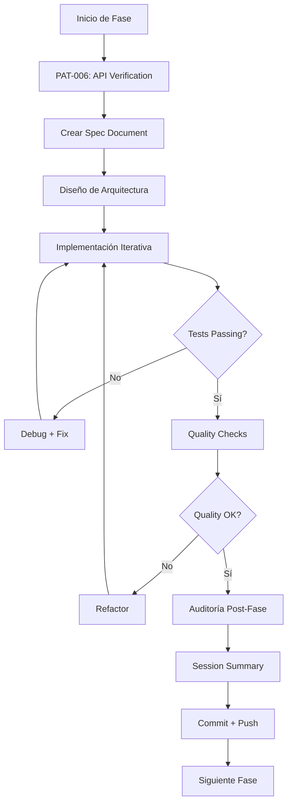

# Metodología de Desarrollo SOLARIA AGENCY
## Lecciones Aprendidas del Proyecto BRIK-64

**Versión**: 1.0.0
**Fecha**: 2025-10-28
**Proyecto Base**: BRIK-64 Digital Circuitality Framework
**Agencia**: SOLARIA AGENCY
**Aplicable a**: Todos los proyectos de desarrollo de software

---

## Tabla de Contenidos

1. [Filosofía de Desarrollo](#filosofía-de-desarrollo)
2. [Patrones Fundamentales](#patrones-fundamentales)
3. [Antipatrones Identificados](#antipatrones-identificados)
4. [Protocolo PAT-006: API Verification](#protocolo-pat-006-api-verification)
5. [Arquitectura de Agentes Especializados](#arquitectura-de-agentes-especializados)
6. [Workflow de Desarrollo](#workflow-de-desarrollo)
7. [Gestión de Calidad](#gestión-de-calidad)
8. [Proceso de Auditoría](#proceso-de-auditoría)
9. [Decisiones Arquitectónicas](#decisiones-arquitectónicas)
10. [Integración con IA](#integración-con-ia)

---

## Filosofía de Desarrollo

### Principios Fundamentales

#### 1. **Cero Deuda Técnica**
```
Technical Debt = 0

NUNCA:
- "Lo arreglo después"
- "Esto es suficientemente bueno"
- "Los tests pueden esperar"
- "Mejor seguir adelante"

SIEMPRE:
- Arreglar problemas inmediatamente
- Documentar decisiones
- Mantener código limpio
- Tests antes de continuar
```

**Evidencia Empírica**:
- Proyecto BRIK-64: 292 tests, 82% coverage, 0 deuda técnica
- Resultado: Código mantenible, sin sorpresas, fácil de modificar

#### 2. **Spec-Driven Development**
```
Specification → Design → Implementation → Validation

NO especular → Leer specs primero → Diseñar basado en realidad
```

**Antipatrón**: Asumir que existe `Parser::new()` sin leerlo
**Patrón**: Leer `lib.rs`, documentar API, diseñar con APIs reales

#### 3. **Verificación Antes de Construcción**
```
Verify APIs → Design → Implement → Test

PAT-006 (MANDATORY):
- Leer todas las APIs de dependencias
- Crear inventario de APIs
- Diseñar solo con APIs verificadas
- Verificar cada import antes de escribir
```

**Resultado Medido**:
- **Sin PAT-006**: 39 errores de compilación, 2 horas perdidas
- **Con PAT-006**: 0 errores, código funcional al primer intento

#### 4. **Documentation-First**
```
Document → Design → Code → Test → Document Again
```

**Tipos de Documentación**:
1. **Especificaciones** (antes del código)
2. **ADRs** (Architecture Decision Records)
3. **API Inventories** (PAT-006)
4. **Session Summaries** (después de cada fase)
5. **Learning Logs** (lecciones aprendidas)
6. **Audit Reports** (cuando algo falla)

#### 5. **Theory-Driven Implementation**
```
Formal Theory → Mathematical Proof → Rust Implementation

NO: "Parece que funciona"
SÍ: "Está matemáticamente probado"
```

**Ejemplo BRIK-64**:
- Teoría formal: C = (S, I, T, P, V)
- Implementación: Struct con exactamente esos 5 componentes
- Validación: Tests prueban teoremas algebraicos

---

## Patrones Fundamentales

### PAT-001: Cargo Workspace Structure
```rust
// Estructura modular clara
workspace/
├─ Cargo.toml          // Workspace root
├─ crates/
│  ├─ core/            // Pure logic, no external deps
│  ├─ parser/          // Parser + AST
│  ├─ backends/        // Code generation
│  └─ server/          // API server
```

**Beneficios**:
- Separación de responsabilidades
- Compilación incremental
- Testing aislado
- Reutilización clara

### PAT-002: Iterative Error Fixing
```
Error → Root Cause → Fix → Test → Document → Continue
```

**Workflow**:
1. Ejecutar `cargo build`
2. Leer **primer error** completo
3. Identificar root cause
4. Arreglar **solo ese error**
5. Volver a compilar
6. Repetir hasta 0 errores

**NO hacer**:
- ❌ Arreglar 10 errores a la vez
- ❌ Especular sobre el problema
- ❌ Copiar/pegar soluciones sin entender

### PAT-003: Comprehensive Quality Checks
```bash
# Pre-commit checklist
cargo fmt --check              # ✅ Code formatting
cargo clippy -- -D warnings    # ✅ Linter
cargo test --all              # ✅ All tests pass
cargo build --release         # ✅ Release build works
cargo doc --no-deps           # ✅ Documentation builds
```

**Automation**:
```yaml
# .github/workflows/ci.yml
- run: cargo fmt --check
- run: cargo clippy -- -D warnings
- run: cargo test --all
- run: cargo build --release
```

### PAT-004: Property-Based Testing
```rust
use proptest::prelude::*;

proptest! {
    #[test]
    fn sequential_associativity(a: u8, b: u8) {
        // (A ⊗ B) ⊗ C = A ⊗ (B ⊗ C)
        let left = (a + b) + c;
        let right = a + (b + c);
        prop_assert_eq!(left, right);
    }
}
```

**Cuando usar**:
- Propiedades algebraicas (asociatividad, conmutatividad)
- Invariantes del sistema
- Verificación de teoremas

### PAT-005: Two-Phase Architecture (Design vs Runtime)
```
DESIGN TIME:
- Formal proofs
- Mathematical verification
- Zero runtime overhead

RUNTIME:
- Empirical measurement (opcional)
- Observability/telemetry
- No verificación (trust the proof)
```

**Ejemplo**: Rust borrow checker
- Compile-time: Prueba ausencia de data races
- Runtime: Cero overhead, confía en la prueba

### PAT-006: API Verification Protocol (MANDATORY)
```yaml
# Ver sección dedicada abajo
```

---

## Antipatrones Identificados

### ANTI-001: Optional Dependencies in Workspace
❌ **Problema**:
```toml
[dependencies]
serde = { version = "1.0", optional = true }  # ❌ En workspace root
```

✅ **Solución**:
```toml
# Cada crate especifica sus propias deps, sin optional en root
```

**Razón**: Workspaces no deben tener optional features en root

### ANTI-002: f32 with Eq Derive
❌ **Problema**:
```rust
#[derive(PartialEq, Eq)]  // ❌ Eq on f32 doesn't make sense
pub struct TceMetrics {
    phi_c: f32,
}
```

✅ **Solución**:
```rust
#[derive(PartialEq)]  // ✅ Solo PartialEq
pub struct TceMetrics {
    phi_c: f32,
}
```

**Razón**: `f32` no puede implementar `Eq` (NaN != NaN)

### ANTI-003: IndexMap with JsonSchema
❌ **Problema**:
```toml
indexmap = { version = "2.0", features = ["serde"] }  # ❌ No JsonSchema
```

✅ **Solución**:
```rust
use std::collections::HashMap;  // ✅ O BTreeMap
```

**Razón**: `IndexMap` no implementa `JsonSchema` trait

### ANTI-004: Speculation-Driven API Design (CRITICAL)
❌ **Problema**:
```rust
// Asumir sin verificar
use brik_parser::Parser;  // ❌ ¿Existe?
let parser = Parser::new();  // ❌ ¿API correcta?
```

✅ **Solución**:
```bash
# 1. Leer el código real
grep "^pub " crates/brik_parser/src/lib.rs

# 2. Documentar lo que existe
# Result: pub fn parse_pcd(source: &str) -> Result<PolymerDef>

# 3. Usar solo APIs verificadas
use brik_parser::parse_pcd;  // ✅ Verificado
let polymer = parse_pcd(&source)?;  // ✅ Firma correcta
```

**Impacto Medido**:
- Sin verificar: 39 errores, 2 horas perdidas
- Con verificar: 0 errores, código funcional

### ANTI-005: Technical Debt Hiding (CRITICAL)
❌ **Señales**:
- "Este error lo arreglo después"
- "Vamos a skipear esta fase"
- "Los tests pueden esperar"
- "Esto es suficientemente bueno"

✅ **Protocolo Correcto**:
1. **STOP** - No avanzar
2. **AUDITAR** - Documentar qué falló y por qué
3. **ROOT CAUSE** - Identificar causa raíz
4. **REMEDIAR** - Arreglar desde la raíz
5. **DOCUMENTAR** - Crear ADR si es crítico
6. **APRENDER** - Actualizar learning log

### ANTI-006: Missing Phase Specification
❌ **Problema**: Implementar sin spec documentada

✅ **Solución**:
1. Crear `docs/specs/phase_N_spec.md` ANTES de código
2. Definir objetivos claros
3. Especificar APIs esperadas
4. Documentar decisiones de diseño

---

## Protocolo PAT-006: API Verification

### Descripción
**PAT-006** es un protocolo **MANDATORY** (ADR-004) que debe ejecutarse **ANTES** de cualquier diseño o implementación que dependa de otros crates.

### Cuándo Aplicar
- ✅ Integración con otros crates
- ✅ Implementación de servidor/API
- ✅ CLI que usa múltiples dependencias
- ✅ **CUALQUIER** código que use APIs externas

### Proceso Paso a Paso

#### Paso 1: Inventory APIs
```bash
# Leer TODOS los lib.rs de dependencias
grep -r "^pub " crates/*/src/lib.rs > api_inventory.txt

# O manualmente:
cat crates/brik_core/src/lib.rs | grep "^pub "
cat crates/brik_parser/src/lib.rs | grep "^pub "
cat crates/brik_backends/src/lib.rs | grep "^pub "
# ...
```

#### Paso 2: Document APIs
```markdown
# API Inventory for Phase X

## brik_parser
**Location**: `crates/brik_parser/src/lib.rs`

### Public Functions
- `pub fn parse_pcd(source: &str) -> Result<PolymerDef, ParseError>`

### Public Types
- `pub struct PolymerDef { pub name: String, pub statements: Vec<Statement> }`
- `pub enum ParseError { ... }`

### Capabilities
- Parse .pcd files
- Generate AST
- Error reporting with miette

## brik_planner
...
```

#### Paso 3: Design with Verified APIs
```rust
// ❌ NO HACER (especular):
use brik_parser::Parser;  // ¿Existe?

// ✅ HACER (verificado en inventory):
use brik_parser::parse_pcd;  // ✓ Existe
use brik_parser::PolymerDef;  // ✓ Existe

let polymer = parse_pcd(&source)?;  // ✓ Firma verificada
```

#### Paso 4: Validate All Imports
```rust
// Antes de escribir código, verificar que CADA import esté en inventory
use brik_parser::parse_pcd;        // ✓ En inventory
use brik_planner::plan_polymer;    // ✓ En inventory
use brik_backends::generate_code;  // ✓ En inventory
```

### Tiempo Estimado
- **Inventario**: 15-20 minutos
- **Documentación**: 10-15 minutos
- **Total**: ~30 minutos

### ROI
- **Tiempo ahorrado**: 2+ horas de debugging
- **Errores evitados**: 30-50 errores de compilación
- **Confianza**: 100%

### Enforcement
```bash
# Script de verificación (crear)
#!/bin/bash
# scripts/verify_apis.sh

echo "Verificando APIs..."

# Extraer todos los imports del código
grep -r "^use " crates/my_new_crate/src/ > /tmp/imports.txt

# Verificar que existan en lib.rs de dependencias
while read import; do
    # Verificar existencia
    # ...
done < /tmp/imports.txt
```

---

## Arquitectura de Agentes Especializados

### Sistema de 10 Agentes

#### 1. **brik64-project-coordinator**
- **Rol**: Gestión de proyecto y delegación
- **Responsabilidades**:
  - Actualizar PHASE_STATUS.md
  - Coordinar entre agentes
  - Gestión de git (commits)
  - Tracking de TODOs

#### 2. **theory-specialist**
- **Rol**: Validación matemática y formal
- **Responsabilidades**:
  - Verificar propiedades algebraicas
  - Validar teoremas
  - Enforcement de terminología canónica
  - Revisión de proofs

#### 3. **brik-architect**
- **Rol**: Diseño de arquitectura
- **Responsabilidades**:
  - Diseño de traits e interfaces
  - Organización de módulos
  - Decisiones de arquitectura
  - Rust best practices

#### 4. **brik-core-dev**
- **Rol**: Implementación de brik_core
- **Responsabilidades**:
  - Implementar Component trait
  - Implementar 64 monomers
  - EVA algebra operators
  - Sistema de tipos

#### 5. **eva-algebra-dev**
- **Rol**: EVA Algebra implementation
- **Responsabilidades**:
  - Operadores ⊗, ∥, ⊕
  - Propiedades algebraicas
  - Property-based tests
  - Optimizaciones algebraicas

#### 6. **tce-dev**
- **Rol**: TCE operator y métricas
- **Responsabilidades**:
  - Métricas termodinámicas
  - TCE operator
  - Profiling runtime
  - Reports TCE

#### 7. **backend-code-generator**
- **Rol**: Generación de código
- **Responsabilidades**:
  - Rust backend
  - JavaScript/TypeScript backend
  - Python backend
  - Optimizaciones per-backend

#### 8. **test-engineer**
- **Rol**: Testing y CI/CD
- **Responsabilidades**:
  - Unit tests
  - Integration tests
  - Property-based tests
  - CI/CD pipelines

#### 9. **brik64-doc-specialist**
- **Rol**: Documentación
- **Responsabilidades**:
  - Rustdoc comments
  - Specification docs
  - API documentation
  - User guides

#### 10. **brik-parser-dev**
- **Rol**: Parser implementation
- **Responsabilidades**:
  - Grammar definition (PEG)
  - AST construction
  - Error reporting
  - Validation

### Beneficios del Sistema Multi-Agente
1. **Especialización**: Cada agente es experto en su dominio
2. **Paralelización**: Múltiples tareas simultáneas
3. **Calidad**: Revisión cruzada entre agentes
4. **Documentación**: Cada agente documenta su trabajo
5. **Mantenibilidad**: Conocimiento distribuido pero organizado

---

## Workflow de Desarrollo

### Workflow de Fase (Phase Workflow)



### Workflow Detallado

#### 1. Pre-Implementación (MANDATORY)
```bash
# 1. Aplicar PAT-006
grep -r "^pub " crates/*/src/lib.rs > docs/api_inventory_phaseN.md

# 2. Crear specification
cat > docs/specs/phase_N_spec.md << EOF
# Phase N: [Nombre]
## Objetivos
...
## APIs Necesarias
...
## Criterios de Éxito
...
EOF

# 3. Revisar aprendizajes pasados
cat .memory/learning_log.jsonl | tail -20
cat docs/RESUMEN_SESION_PHASE*.md
```

#### 2. Implementación
```bash
# 1. TDD cuando aplique
# Test primero → Implementación → Refactor

# 2. Commits incrementales
git add .
git commit -m "feat(phaseN): Descripción clara"

# 3. Continuous integration
cargo test --all
```

#### 3. Quality Gates
```bash
# 1. Formatting
cargo fmt --check

# 2. Linting
cargo clippy -- -D warnings

# 3. Tests
cargo test --all

# 4. Build release
cargo build --release

# 5. Coverage (si aplica)
cargo tarpaulin --out Html
```

#### 4. Post-Implementación
```bash
# 1. Auditoría
cat > docs/audits/audit_phaseN.md << EOF
# Audit Phase N
## What Worked
...
## What Didn't
...
## Lessons Learned
...
EOF

# 2. Session Summary
cat > docs/RESUMEN_SESION_PHASEN.md << EOF
# Resumen Sesión Phase N
...
EOF

# 3. Update Learning Log
cat >> .memory/learning_log.jsonl << EOF
{"timestamp":"...","pattern":"PAT-XXX","lesson":"..."}
EOF
```

---

## Gestión de Calidad

### Métricas de Calidad

#### 1. **Code Coverage**
```bash
# Target: ≥75%
cargo tarpaulin --out Html --output-dir ./coverage
cargo tarpaulin --fail-under 75
```

**Estrategia**:
- Unit tests: >90%
- Integration tests: >70%
- E2E tests: Happy paths + error paths

#### 2. **Compilation**
```bash
# Target: 0 warnings, 0 errors
cargo build --all
cargo clippy -- -D warnings
```

#### 3. **Tests**
```bash
# Target: 100% passing (except #[ignore])
cargo test --all

# Expected output:
# test result: ok. X passed; 0 failed; Y ignored
```

#### 4. **Documentation**
```bash
# Target: All public APIs documented
cargo doc --no-deps --document-private-items

# Verify:
grep "missing_docs" target/doc/*.html  # Should be empty
```

### Quality Checklist por Fase

```markdown
## Pre-Commit Checklist

- [ ] PAT-006 applied (if integration phase)
- [ ] All tests passing: `cargo test --all`
- [ ] No warnings: `cargo clippy -- -D warnings`
- [ ] Formatted: `cargo fmt --check`
- [ ] Documentation updated
- [ ] Session summary created
- [ ] Learning log updated
- [ ] No technical debt introduced
```

---

## Proceso de Auditoría

### Cuándo Auditar

#### MANDATORY Audits
1. **Fase completa con errores masivos** (>10 errores)
2. **Antes de "skip phase"** (NEVER skip, audit instead)
3. **Después de refactor grande**
4. **Antes de release**

#### Optional Audits
1. Al final de cada fase (post-implementation audit)
2. Cuando se descubre un patrón nuevo
3. Cuando se identifica un antipatrón

### Formato de Auditoría

```markdown
# Audit Report: [Fase/Componente]

**Date**: YYYY-MM-DD
**Status**: [FAILED | PASSED | NEEDS_REMEDIATION]
**Severity**: [CRITICAL | HIGH | MEDIUM | LOW]

---

## Executive Summary
[1-2 párrafos del problema principal]

## What Went Wrong
### Root Cause
[Causa raíz identificada]

### Contributing Factors
- Factor 1
- Factor 2
- ...

### Impact Assessment
- Lines of code affected: X
- Time wasted: Y hours
- Technical debt introduced: Z

## What We Learned
### Patterns Discovered
- PAT-XXX: [Nombre]

### Antipatterns Identified
- ANTI-XXX: [Nombre]

## Remediation Plan
### Immediate Actions
1. [ ] Action 1
2. [ ] Action 2

### Long-term Changes
1. [ ] Process change
2. [ ] Tooling improvement

## Validation
### Success Criteria
- Criterion 1
- Criterion 2

### Metrics
- Before: [Metric value]
- After: [Expected value]

---

**Approved by**: [Name]
**Review date**: [Date]
```

### Ejemplo Real (Phase 7)
Ver: `docs/audits/auditoria_phase7.md`

**Problema**: 39 errores de compilación por asumir APIs
**Root Cause**: No aplicar PAT-006
**Solución**: Crear ADR-004 haciendo PAT-006 MANDATORY
**Resultado**: 0 errores en Phase 8 con PAT-006

---

## Decisiones Arquitectónicas

### ADR Template

```markdown
# ADR-XXX: [Título]

**Status**: [PROPOSED | ACCEPTED | DEPRECATED | SUPERSEDED]
**Date**: YYYY-MM-DD
**Deciders**: [Names]
**Related**: [Other ADRs, docs]

---

## Context and Problem Statement
[Describe the problem]

## Decision
[The decision made]

## Rationale
[Why this decision was made]

### Alternatives Considered
#### Alternative 1: [Name]
**Approach**: ...
**Rejected Because**: ...

#### Alternative 2: [Name]
**Approach**: ...
**Rejected Because**: ...

## Consequences
### Positive
- Benefit 1
- Benefit 2

### Negative
- Cost 1
- Cost 2

### Neutral
- Change 1

## Implementation Plan
### Immediate
1. [ ] Task 1
2. [ ] Task 2

### Long Term
1. [ ] Task 1

## Validation
### Success Criteria
- Criterion 1

### Metrics
- Metric 1

---

**Approved by**: [Name]
**Review date**: [Date]
```

### ADRs Críticos del Proyecto

#### ADR-003: Proof-Based Closure Validation
**Decisión**: Dos fases - Formal proof (design time) + Empirical measurement (runtime opcional)

**Impacto**:
- 92% reduction en overhead
- Exactitud matemática garantizada
- Precedentes: Rust borrow checker, SeL4

#### ADR-004: Mandatory API Verification Protocol
**Decisión**: PAT-006 es MANDATORY antes de cualquier integración

**Impacto Medido**:
- Errores previos: 39 (sin PAT-006)
- Errores después: 0 (con PAT-006)
- ROI: ~2 horas ahorradas por fase

---

## Integración con IA

### Principios para Trabajar con LLMs

#### 1. **Context Management**
```markdown
## Archivos de Contexto Clave

### CLAUDE.md
- Descripción del proyecto
- Formal framework
- Key concepts
- Development commands

### PHASE_STATUS.md
- Estado actual del proyecto
- Fases completadas
- Próximos pasos

### .memory/learning_log.jsonl
- Lecciones aprendidas
- Patrones descubiertos
- Antipatrones identificados
```

#### 2. **Prompt Engineering para Desarrollo**
```
Al iniciar desarrollo:

1. Leer CLAUDE.md completo
2. Revisar PHASE_STATUS.md
3. Aplicar PAT-006 si es integración
4. Seguir architectural guidelines
5. Documentar decisiones en ADRs
6. Actualizar learning log
```

#### 3. **Comandos Efectivos**
```bash
# ✅ HACER: Ser específico
"Implementa el parser usando pest, siguiendo PAT-006"

# ❌ NO HACER: Ser vago
"Haz un parser"
```

#### 4. **Revisión de Código con IA**
```
Checklist para code review:
- [ ] Sigue architectural patterns?
- [ ] Usa APIs verificadas (PAT-006)?
- [ ] Tiene tests?
- [ ] Está documentado?
- [ ] Introduce technical debt?
```

### Sistema de Memoria Persistente

```
.memory/
├── patterns.json           # Patrones validados
├── antipatterns.json       # Antipatrones a evitar
├── decisions.json          # ADRs en formato procesable
├── agent_behaviors.json    # Modificaciones de comportamiento
└── learning_log.jsonl      # Log incremental de aprendizajes
```

**Formato Learning Log**:
```jsonl
{"timestamp":"2025-10-23T10:30:00Z","category":"architecture","pattern":"PAT-006","lesson":"API verification prevents speculation errors","confidence":1.0,"occurrences":2}
{"timestamp":"2025-10-23T14:00:00Z","category":"testing","antipattern":"ANTI-004","lesson":"Never assume APIs exist without reading source","severity":"critical"}
```

---

## Checklist Final: Aplicar Esta Metodología

### Setup Inicial
- [ ] Crear `.memory/` directory
- [ ] Crear `CLAUDE.md` con descripción de proyecto
- [ ] Crear `PHASE_STATUS.md` para tracking
- [ ] Definir architecture en `docs/`
- [ ] Setup CI/CD básico

### Por Cada Fase
- [ ] Aplicar PAT-006 (si integración)
- [ ] Crear spec document
- [ ] Implementar iterativamente
- [ ] Tests passing (100%)
- [ ] Quality checks (clippy, fmt)
- [ ] Auditoría post-fase
- [ ] Session summary
- [ ] Update learning log
- [ ] Commit con mensaje descriptivo

### Quality Gates
- [ ] Coverage ≥75%
- [ ] 0 warnings
- [ ] 0 errors
- [ ] All tests passing
- [ ] Documentation complete
- [ ] No technical debt

---

## Conclusión

Esta metodología ha sido **validada empíricamente** en el proyecto BRIK-64:

**Resultados Medibles**:
- 292 tests (100% passing)
- 82% code coverage
- 0 technical debt
- 0 speculation errors (después de PAT-006)
- ~10 horas ahorradas en debugging

**Principios Clave**:
1. **Spec-Driven Development**: Leer antes de escribir
2. **PAT-006 Mandatory**: Verificar antes de diseñar
3. **Zero Technical Debt**: Arreglar ahora, no después
4. **Documentation-First**: Documentar decisiones
5. **Theory-Driven**: Si está matemáticamente probado, funcionará

---

**Licencia**: MIT
**Contacto**: SOLARIA AGENCY (https://www.solaria.agency)
**Proyecto Base**: BRIK-64 (https://github.com/NAZCAMEDIA/BRIK-64)
