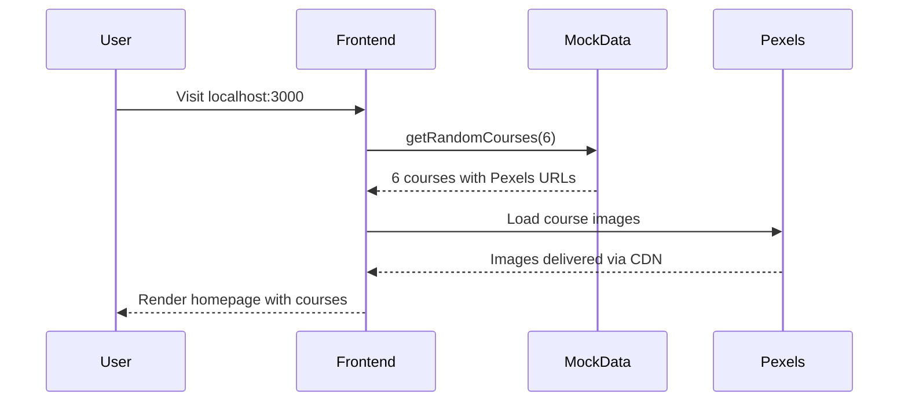
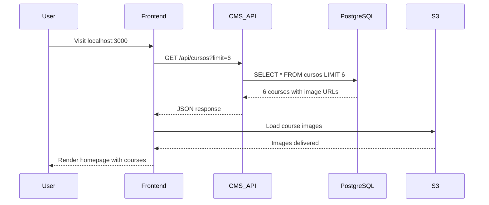

# CEPComunicacion v2 - Architecture Map

## System Architecture Overview (2025-11-24)

```mermaid
graph TB
    subgraph "FRONTEND [Port 3000] - Next.js 14.2.15"
        FrontendApp["Frontend Application<br/>React 19 + Vite"]

        subgraph "🎭 MOCKUP PAGES (No Backend)"
            HomePage["Homepage<br/>✅ Clean Hero + 6 Courses"]
            CheckoutPage["Checkout/Payment<br/>✅ Full Stripe-like Form"]
            CampusPage["Campus Virtual Login<br/>✅ Student Portal Mockup"]
            CoursesPage["Courses Listing<br/>✅ All 15 Mockups"]
            BlogPage["Blog<br/>🎭 Mockup"]
            CiclosPage["Ciclos<br/>🎭 Mockup"]
            SedesPage["Sedes<br/>🎭 Mockup"]
            FAQPage["FAQ<br/>🎭 Mockup"]
            ContactPage["Contacto<br/>🎭 Mockup"]
        end

        subgraph "📦 MOCKUP DATA"
            MockCourses["mockCourses.ts<br/>✅ 15 Courses + Pexels Images"]
        end

        FrontendApp --> HomePage
        FrontendApp --> CheckoutPage
        FrontendApp --> CampusPage
        FrontendApp --> CoursesPage
        FrontendApp --> BlogPage
        FrontendApp --> CiclosPage
        FrontendApp --> SedesPage
        FrontendApp --> FAQPage
        FrontendApp --> ContactPage

        HomePage -.->|"getRandomCourses(6)"| MockCourses
        CoursesPage -.->|"mockCourses"| MockCourses
        CheckoutPage -.->|"static data"| MockCourses
    end

    subgraph "ADMIN DASHBOARD [Port 3001] - Next.js 15.2.3"
        AdminApp["Admin Dashboard NEW<br/>🎭 UI Mockup Only"]
        AdminLogin["Login Page<br/>✅ Montserrat Font Fixed"]
        AdminDashboard["Dashboard<br/>🎭 Mockup"]

        AdminApp --> AdminLogin
        AdminApp --> AdminDashboard
    end

    subgraph "CMS BACKEND [Port 3002] - Payload 3.62.1"
        CMSApp["Payload CMS<br/>Next.js 15.2.3"]

        subgraph "✅ FUNCTIONAL PAGES"
            CMSLogin["Admin Login<br/>✅ Authentication"]
            CMSDashboard["CMS Dashboard<br/>✅ CRUD Operations"]
            CursosCollection["Cursos Collection<br/>✅ Full CRUD"]
            CiclosCollection["Ciclos Collection<br/>✅ Full CRUD"]
            ConvocatoriasCollection["Convocatorias<br/>✅ Full CRUD"]
            SedesCollection["Sedes Collection<br/>✅ Full CRUD"]
            LeadsCollection["Leads Collection<br/>✅ Full CRUD"]
            AnalyticsPage["Analytics Page<br/>✅ KPIs Mockup"]
        end

        CMSApp --> CMSLogin
        CMSApp --> CMSDashboard
        CMSDashboard --> CursosCollection
        CMSDashboard --> CiclosCollection
        CMSDashboard --> ConvocatoriasCollection
        CMSDashboard --> SedesCollection
        CMSDashboard --> LeadsCollection
        CMSDashboard --> AnalyticsPage
    end

    subgraph "DATABASE LAYER [Port 5432]"
        PostgreSQL["PostgreSQL 16.10<br/>✅ 27 Tables + 8 Courses"]

        subgraph "✅ FUNCTIONAL TABLES"
            UsersTable["users<br/>✅ Auth + RBAC"]
            CursosTable["cursos<br/>✅ 8 Real Courses"]
            CiclosTable["ciclos<br/>✅ FP Programs"]
            ConvocatoriasTable["convocatorias<br/>✅ Schedules"]
            SedesTable["sedes<br/>✅ Campuses"]
            LeadsTable["leads<br/>✅ Student Leads"]
        end

        PostgreSQL --> UsersTable
        PostgreSQL --> CursosTable
        PostgreSQL --> CiclosTable
        PostgreSQL --> ConvocatoriasTable
        PostgreSQL --> SedesTable
        PostgreSQL --> LeadsTable
    end

    subgraph "CACHE & QUEUE [Port 6379]"
        Redis["Redis 7.0.15<br/>✅ Running"]
        BullMQ["BullMQ Infrastructure<br/>✅ Configured<br/>🔄 Workers Pending"]
    end

    subgraph "EXTERNAL SERVICES"
        Pexels["Pexels CDN<br/>✅ 15 Course Images"]
    end

    %% Functional Connections (Solid Lines)
    CMSApp -.->|"REST API<br/>/api/*"| PostgreSQL
    CMSLogin -.->|"JWT Auth"| UsersTable
    CursosCollection -.->|"CRUD"| CursosTable
    CiclosCollection -.->|"CRUD"| CiclosTable
    ConvocatoriasCollection -.->|"CRUD"| ConvocatoriasTable
    SedesCollection -.->|"CRUD"| SedesTable
    LeadsCollection -.->|"CRUD"| LeadsTable

    CMSApp -.->|"Job Queue"| Redis
    Redis -.-> BullMQ

    %% Mockup Connections (Dotted Lines)
    HomePage -.->|"CDN"| Pexels
    CoursesPage -.->|"CDN"| Pexels
    CheckoutPage -.->|"CDN"| Pexels

    %% Missing Connections (Future Integration)
    FrontendApp -.->|"🔄 TODO: API Integration"| CMSApp
    BullMQ -.->|"🔄 TODO: Workers"| CMSApp

    style FrontendApp fill:#e1f5ff,stroke:#01579b,stroke-width:3px
    style CMSApp fill:#c8e6c9,stroke:#2e7d32,stroke-width:3px
    style AdminApp fill:#fff9c4,stroke:#f57f17,stroke-width:3px
    style PostgreSQL fill:#c8e6c9,stroke:#2e7d32,stroke-width:3px
    style Redis fill:#c8e6c9,stroke:#2e7d32,stroke-width:3px

    style HomePage fill:#fff9c4,stroke:#f57f17,stroke-width:2px
    style CheckoutPage fill:#fff9c4,stroke:#f57f17,stroke-width:2px
    style CampusPage fill:#fff9c4,stroke:#f57f17,stroke-width:2px
    style CoursesPage fill:#fff9c4,stroke:#f57f17,stroke-width:2px
    style MockCourses fill:#fff9c4,stroke:#f57f17,stroke-width:2px
    style AnalyticsPage fill:#fff9c4,stroke:#f57f17,stroke-width:2px
    style BullMQ fill:#ffccbc,stroke:#d84315,stroke-width:2px
```



## Legend

| Symbol | Meaning |
|--------|---------|
| ✅ | Functional & Operational |
| 🎭 | Mockup (No Backend Integration) |
| 🔄 | Infrastructure Ready, Implementation Pending |
| Solid Line | Active Connection |
| Dotted Line | Mockup/Static Connection |

---

## Component Status Matrix

### Frontend (Port 3000)

| Component | Type | Backend | Status |
|-----------|------|---------|--------|
| Homepage | Page | Mockup | ✅ 6 courses from mockCourses.ts |
| Checkout/Payment | Page | Mockup | ✅ Full Stripe-like form |
| Campus Virtual | Page | Mockup | ✅ Login UI only |
| Courses Listing | Page | Mockup | ✅ All 15 mockup courses |
| Blog | Page | Mockup | 🎭 Static content |
| Ciclos | Page | Mockup | 🎭 Static content |
| Sedes | Page | Mockup | 🎭 Static content |
| FAQ | Page | Mockup | 🎭 Static content |
| Contacto | Page | Mockup | 🎭 Static content |
| HeroCarouselSimple | Component | Static | ✅ 3 Pexels images, no text |
| CourseCard | Component | Mockup | ✅ Displays mockup data |
| mockCourses.ts | Data | Static | ✅ 15 courses with Pexels URLs |

### CMS Backend (Port 3002)

| Component | Type | Database | Status |
|-----------|------|----------|--------|
| Admin Login | Auth | PostgreSQL | ✅ JWT authentication |
| Dashboard | UI | PostgreSQL | ✅ CRUD operations |
| Cursos Collection | CRUD | PostgreSQL | ✅ 8 real courses |
| Ciclos Collection | CRUD | PostgreSQL | ✅ FP programs |
| Convocatorias | CRUD | PostgreSQL | ✅ Schedules |
| Sedes Collection | CRUD | PostgreSQL | ✅ Campuses |
| Leads Collection | CRUD | PostgreSQL | ✅ Student leads |
| Analytics Page | Dashboard | Mockup | ✅ KPIs mockup (static) |
| REST API | API | PostgreSQL | ✅ `/api/cursos`, etc. |

### Database (Port 5432)

| Table | Records | Relationships | Status |
|-------|---------|---------------|--------|
| users | Multiple | RBAC roles | ✅ Functional |
| cursos | 8 | → ciclos, convocatorias | ✅ Functional |
| ciclos | Multiple | ← cursos | ✅ Functional |
| convocatorias | Multiple | → cursos, sedes | ✅ Functional |
| sedes | Multiple | ← convocatorias | ✅ Functional |
| leads | Multiple | → cursos | ✅ Functional |
| + 21 more | Various | Full schema | ✅ Functional |

### Infrastructure

| Service | Port | Status | Notes |
|---------|------|--------|-------|
| PostgreSQL | 5432 | ✅ Running | 27 tables, 8 courses |
| Redis | 6379 | ✅ Running | Job queue ready |
| BullMQ | N/A | 🔄 Pending | Infrastructure ready |
| Nginx | 80 | 🔄 Production | Configured, not active locally |

---

## Data Flow Diagrams

### Current Flow (Mockup Data)



### Future Flow (API Integration)



---

## Critical Integration Points

### 🔴 Frontend → CMS API (TODO)

**Current:** Frontend uses static `mockCourses.ts`
**Required:** Replace with API calls to `http://localhost:3002/api/cursos`

**Implementation Steps:**
1. Create API client in `lib/api.ts`
2. Replace `getRandomCourses()` with `fetchCourses()`
3. Add loading states and error handling
4. Update image URLs from Pexels to S3/Payload uploads

**Files to Modify:**
- `apps/web-next/app/(frontend)/page.tsx`
- `apps/web-next/app/(frontend)/cursos/page.tsx`
- `apps/web-next/components/ui/CourseCard.tsx`

### 🔴 Campus Virtual → Authentication (TODO)

**Current:** Mockup login page (no backend)
**Required:** Integrate with Payload CMS authentication

**Implementation Steps:**
1. Create auth API endpoints
2. Implement JWT token management
3. Add protected routes
4. Create student dashboard

### 🔴 Checkout → Payment Gateway (TODO)

**Current:** Mockup payment form
**Required:** Integrate with Stripe/PayPal

**Implementation Steps:**
1. Set up Stripe account
2. Implement payment API endpoints
3. Add webhook handlers
4. Create order management system

### 🟡 Analytics → Real Data (Partial)

**Current:** Mockup KPIs with static numbers
**Required:** Connect to PostgreSQL metrics

**Implementation Steps:**
1. Create analytics queries
2. Implement GA4 tracking
3. Add Meta Pixel integration
4. Create real-time dashboard

---

## Repository Structure

```
cepcomunicacion/
├── apps/
│   ├── web-next/           # Frontend (Port 3000) 🎭 Mockup
│   │   ├── app/
│   │   │   └── (frontend)/
│   │   │       ├── page.tsx                  # ✅ Homepage
│   │   │       ├── checkout/page.tsx         # ✅ Payment mockup
│   │   │       ├── acceso-alumnos/page.tsx   # ✅ Campus mockup
│   │   │       ├── cursos/page.tsx           # ✅ Courses listing
│   │   │       └── [otros...]
│   │   ├── components/
│   │   │   └── ui/
│   │   │       ├── HeroCarouselSimple.tsx    # ✅ Clean carousel
│   │   │       └── CourseCard.tsx            # ✅ Course display
│   │   └── lib/
│   │       └── mockCourses.ts                # ✅ 15 mockup courses
│   │
│   ├── admin/              # Admin NEW (Port 3001) 🎭 Mockup
│   │   ├── app/
│   │   │   ├── login/page.tsx                # ✅ Login UI
│   │   │   └── dashboard/page.tsx            # 🎭 Dashboard mockup
│   │   └── app/globals.css                   # ✅ Font fixed
│   │
│   └── cms/                # CMS (Port 3002) ✅ Functional
│       ├── app/(dashboard)/
│       │   ├── cursos/page.tsx               # ✅ Cursos CRUD
│       │   ├── ciclos/page.tsx               # ✅ Ciclos CRUD
│       │   ├── analiticas/page.tsx           # ✅ Analytics mockup
│       │   └── [otros...]
│       └── @payload-config/
│           ├── collections/
│           │   ├── Cursos.ts                 # ✅ Schema + hooks
│           │   ├── Ciclos.ts                 # ✅ Schema + hooks
│           │   └── [otros...]
│           └── payload.config.ts             # ✅ Main config
│
├── __tests__/              # Test suites
│   ├── components/
│   │   ├── HeroCarouselSimple.test.tsx       # ✅ Created
│   │   └── CourseCard.test.tsx               # ✅ Created
│   └── lib/
│       └── mockCourses.test.ts               # ✅ 5/5 passing
│
├── docs/
│   ├── ARCHITECTURE_MAP.md                   # ✅ This file
│   └── specs/
│
├── .memory/
│   └── SESSION_2025-11-24_CLIENT_DEMO.md     # ✅ Session docs
│
└── CLAUDE.md                                 # ✅ Main project docs
```

---

## Next Development Session Checklist

Before starting next session:

1. ✅ **Verify All Services Running:**
   ```bash
   lsof -ti:3000  # Frontend
   lsof -ti:3001  # Admin
   lsof -ti:3002  # CMS
   lsof -ti:5432  # PostgreSQL
   lsof -ti:6379  # Redis
   ```

2. ✅ **Clean Stale Compiled Files:**
   ```bash
   find apps -name "*.js" -path "*/components/*" -delete
   find apps -name "*.d.ts" -path "*/components/*" -delete
   rm -rf apps/*/. next apps/*/node_modules/.cache
   ```

3. ✅ **Review Session Documentation:**
   - Read `.memory/SESSION_2025-11-24_CLIENT_DEMO.md`
   - Check `CLAUDE.md` for current phase status
   - Review this `ARCHITECTURE_MAP.md`

4. ✅ **Identify Current Task:**
   - Check git status for uncommitted changes
   - Review project management board
   - Prioritize: Frontend API integration OR BullMQ workers

---

**Generated:** 2025-11-24 18:05 UTC
**Status:** Ready for client demo + Next development phase
**Next Priority:** Frontend ↔ CMS API Integration
