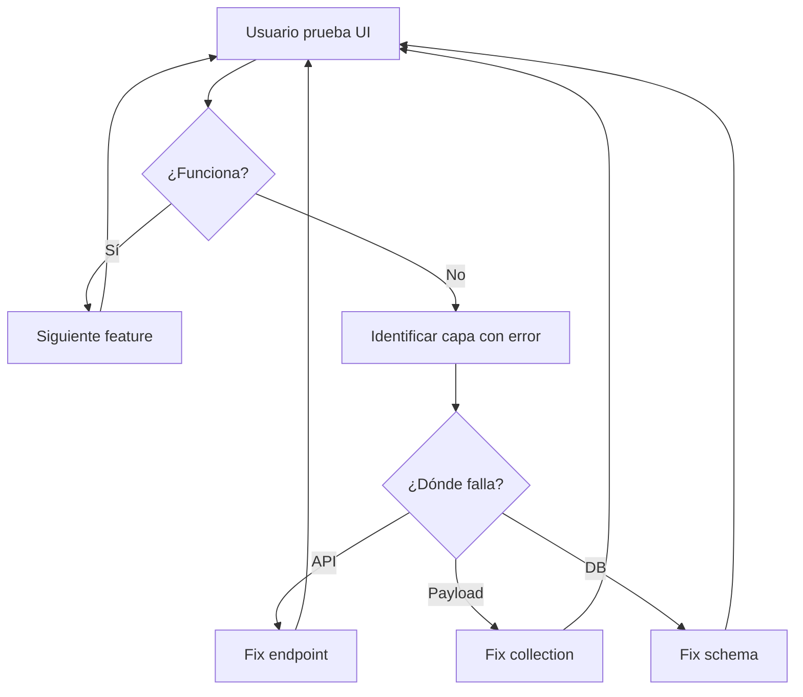

# Metodología Outside-In: De Usuario a Base de Datos

**Fecha:** 2025-11-14
**Proyecto:** CEPComunicacion v2
**Fase:** Implementación de Conexión Real (Payload CMS + PostgreSQL)

## 🎯 Principio Fundamental

**Construir desde la experiencia del usuario hacia la base de datos**, validando cada capa inmediatamente antes de avanzar a la siguiente.

```
┌─────────────────────────────────────────────────┐
│ ENFOQUE TRADICIONAL (Inside-Out)               │
├─────────────────────────────────────────────────┤
│ 1. PostgreSQL (schema, migrations)              │
│ 2. Payload CMS (collections, relations)         │
│ 3. API Endpoints (REST/GraphQL)                 │
│ 4. Frontend/Dashboard (consume API)             │
│                                                 │
│ ❌ Problema: Errores se descubren al final      │
└─────────────────────────────────────────────────┘

┌─────────────────────────────────────────────────┐
│ ENFOQUE SOLARIA (Outside-In)                   │
├─────────────────────────────────────────────────┤
│ 1. Usuario interactúa con Dashboard             │
│ 2. Dashboard requiere endpoint → crear API      │
│ 3. API requiere collection → crear en Payload   │
│ 4. Payload requiere tabla → crear en PostgreSQL │
│                                                 │
│ ✅ Ventaja: Validación inmediata en cada paso   │
└─────────────────────────────────────────────────┘
```

## 📋 Metodología Paso a Paso

### Fase 0: Preparación
```bash
# 1. Limpiar datos mock del dashboard
- Mover archivos mock a .backups/mock-data/
- Actualizar páginas para mostrar "sin datos"
- Mantener tipos TypeScript intactos

# 2. Verificar servicios base
✓ PostgreSQL corriendo (puerto 5432)
✓ Redis corriendo (puerto 6379)
✓ Payload CMS configurado
✓ Next.js dev server activo
```

### Fase 1: Desde el Usuario
```
Usuario experimenta → Identifica necesidad → Reporta caso de uso
```

**Ejemplo:**
```
"Quiero crear un nuevo curso desde el dashboard"
↓
"No puedo porque no hay endpoint POST /api/courses"
↓
CREAR endpoint primero, LUEGO backend
```

### Fase 2: Validación Incremental

Para cada feature:

1. **Usuario prueba UI** → identifica qué necesita
2. **Crear endpoint API** → mínimo viable
3. **Crear collection Payload** → campos básicos
4. **Crear tabla PostgreSQL** → schema mínimo
5. **Probar desde UI** → validar funciona end-to-end
6. **Iterar** → agregar campos/relaciones según necesidad

### Fase 3: Relaciones (Crítico)

**Probar relaciones INMEDIATAMENTE al crearlas:**

```typescript
// ❌ MAL: Crear todas las relaciones y probar al final
await createCourses()
await createCycles()
await createCampuses()
await createConvocations() // Relaciona todo
// Si falla, ¿dónde está el error?

// ✅ BIEN: Probar cada relación al crearla
await createCourses()
await testCoursesAPI() // ✓ Funciona

await createCycles()
await testCyclesAPI() // ✓ Funciona

await linkCourseToCycle() // Relación 1:N
await testCourseWithCycle() // ✓ Relación funciona

await createCampuses()
await linkCourseToManyCampuses() // Relación N:M
await testCourseWithCampuses() // ✓ Relación funciona
```

## 🔧 Herramientas de Validación

### 1. Dashboard como Herramienta de Testing
El dashboard NO es solo UI, es herramienta de validación:

```tsx
// Cada página debe mostrar estado de datos
<DashboardPage>
  {loading && <Spinner />}
  {error && <ErrorAlert error={error} />}
  {data.length === 0 && <EmptyState action="Crear Primero" />}
  {data.length > 0 && <DataGrid data={data} />}
</DashboardPage>
```

### 2. Logs Detallados en Cada Capa
```typescript
// API Layer
console.log('[API] POST /courses', req.body)
console.log('[API] Response:', res.data)

// Payload Layer
console.log('[Payload] beforeCreate hook', doc)
console.log('[Payload] afterCreate hook', doc)

// DB Layer
console.log('[PostgreSQL] INSERT', query)
console.log('[PostgreSQL] Result:', result.rows)
```

### 3. Payload CMS Admin Panel
```
http://localhost:3000/admin

- Ver colecciones creadas
- Inspeccionar relaciones
- Probar CRUD manualmente
- Validar constraints
```

## 📊 Ejemplo Práctico: Crear Entidad "Courses"

### Iteración 1: Curso Básico (sin relaciones)
```
1. Usuario: "Quiero ver lista de cursos"
   → Dashboard: GET /api/courses (404)

2. Crear endpoint básico:
   GET /api/courses → []

3. Usuario: "Quiero crear curso"
   → Dashboard: POST /api/courses (500)

4. Crear collection Payload:
   - nombre: string
   - descripcion: text

5. Crear tabla PostgreSQL:
   CREATE TABLE courses (
     id uuid PRIMARY KEY,
     nombre varchar(255),
     descripcion text
   )

6. Probar desde UI:
   ✓ Crear curso → aparece en lista
   ✓ Editar curso → cambios se guardan
   ✓ Eliminar curso → desaparece
```

### Iteración 2: Relación Course → Cycle (N:1)
```
1. Usuario: "Quiero asignar curso a un ciclo"
   → Dashboard: Selector de ciclos vacío

2. Crear Cycles primero:
   - Repetir Iteración 1 para Cycles
   - Validar CRUD de Cycles funciona

3. Agregar relación:
   // Payload collection
   {
     name: 'courses',
     fields: [
       {
         name: 'cycle',
         type: 'relationship',
         relationTo: 'cycles',
         required: true
       }
     ]
   }

4. Agregar FK en PostgreSQL:
   ALTER TABLE courses
   ADD COLUMN cycle_id uuid REFERENCES cycles(id)

5. Probar desde UI:
   ✓ Selector muestra ciclos disponibles
   ✓ Asignar ciclo a curso
   ✓ Ver curso con ciclo asignado
   ✓ Filtrar cursos por ciclo
```

### Iteración 3: Relación Course ↔ Campuses (N:M)
```
1. Usuario: "Un curso puede estar en varios campus"
   → Dashboard: Necesito multi-selector

2. Crear tabla intermedia:
   CREATE TABLE course_campuses (
     course_id uuid REFERENCES courses(id),
     campus_id uuid REFERENCES campuses(id),
     PRIMARY KEY (course_id, campus_id)
   )

3. Actualizar Payload collection:
   {
     name: 'campuses',
     type: 'relationship',
     relationTo: 'campuses',
     hasMany: true
   }

4. Probar desde UI:
   ✓ Seleccionar múltiples campus
   ✓ Ver curso con N campus
   ✓ Agregar/quitar campus dinámicamente
```

## 🚨 Reglas de Oro

### 1. No Avanzar Sin Validar
```
❌ "Voy a crear 5 collections y luego pruebo"
✅ "Creo 1 collection, pruebo, funciona → siguiente"
```

### 2. Usuario Dicta el Orden
```
❌ "Primero hago el schema completo"
✅ "Usuario necesita X → implemento X → usuario prueba"
```

### 3. Relaciones Incrementales
```
❌ Course → Cycle + Campus + Convocation (todo junto)
✅ Course solo → Course+Cycle → Course+Cycle+Campus → ...
```

### 4. Fallar Rápido
```
Si algo no funciona:
1. NO continuar a la siguiente feature
2. Debuggear en la capa actual
3. Validar con usuario que funciona
4. ENTONCES avanzar
```

## 📈 Métricas de Éxito

Al final de cada sesión:
- ✅ Usuario puede ejecutar N casos de uso desde UI
- ✅ Cada endpoint responde correctamente
- ✅ Payload Admin muestra datos consistentes
- ✅ PostgreSQL tiene integridad referencial
- ✅ Zero errores en consola

## 🔄 Flujo de Iteración



## 📝 Checklist por Feature

- [ ] Usuario describe caso de uso
- [ ] Dashboard muestra estado actual (loading/error/empty)
- [ ] Endpoint API creado y documentado
- [ ] Collection Payload configurada
- [ ] Tabla PostgreSQL con constraints
- [ ] Relaciones probadas end-to-end
- [ ] Usuario valida feature funciona
- [ ] Logs limpios sin errores
- [ ] Commit con mensaje descriptivo

---

**Esta metodología garantiza:**
- ✅ Menos refactoring
- ✅ Bugs detectados temprano
- ✅ Usuario involucrado en validación
- ✅ Código que realmente se usa
- ✅ Relaciones correctas desde el inicio
