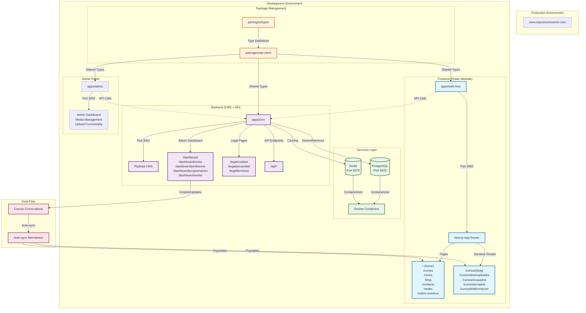

# CEP Comunicación - System Architecture Diagram

## Current System Structure



## Component Responsibilities

### Frontend (apps/web-next)

- **Purpose**: Public website for course presentation and information
- **Technology**: Next.js 14+ with App Router
- **Key Features**:
  - Course catalog display
  - Course convocation listings
  - Static content pages (About, Contact, etc.)
  - Responsive design with TailwindCSS
  - SEO optimization

### Backend CMS (apps/cms)

- **Purpose**: Content management and administrative dashboard
- **Technology**: Payload CMS + Next.js
- **Key Features**:
  - Course management interface
  - Professor administration
  - Scheduling and programming
  - Legal page management
  - API endpoints for frontend consumption

### Admin Panel (apps/admin)

- **Purpose**: Administrative operations and media management
- **Technology**: Next.js with custom admin interface
- **Key Features**:
  - Media upload and management
  - Administrative dashboard
  - System configuration

### Services Layer

- **PostgreSQL**: Primary data storage
- **Redis**: Caching and session management
- **Docker**: Container orchestration for development

## Integration Points

### Course Convocation Sync

1. **Creation**: Admin creates course convocations in CMS dashboard
2. **Processing**: Backend processes and validates course data
3. **Sync**: Automatic synchronization to frontend
4. **Display**: Frontend displays updated course information

### API Communication

- Frontend consumes CMS API endpoints
- Shared type definitions ensure consistency
- Real-time updates through proper caching strategy

## Development Workflow

### Local Development

```bash
# Start services
docker-compose up -d postgres redis

# Start backend (CMS)
cd apps/cms && pnpm dev  # Port 3001

# Start frontend
cd apps/web-next && pnpm dev  # Port 3000

# Start admin panel (optional)
cd apps/admin && pnpm dev  # Port 3002
```

### Build Process

- Each app has independent build configuration
- Standalone output for Docker deployment
- TypeScript compilation with strict mode
- Optimized bundles for production

## Key Technical Decisions

### Monorepo Structure

- Shared packages for type safety
- Independent deployment capability
- Consistent tooling across applications

### Next.js App Router

- Modern React patterns
- Server-side rendering
- Optimized performance

### Payload CMS Integration

- Headless CMS architecture
- Type-safe API generation
- Admin interface included

### Docker Services

- Consistent development environment
- Easy deployment scaling
- Service isolation

---

_Last Updated: 2025-11-17_
_Status: Architecture Documented and Verified_
