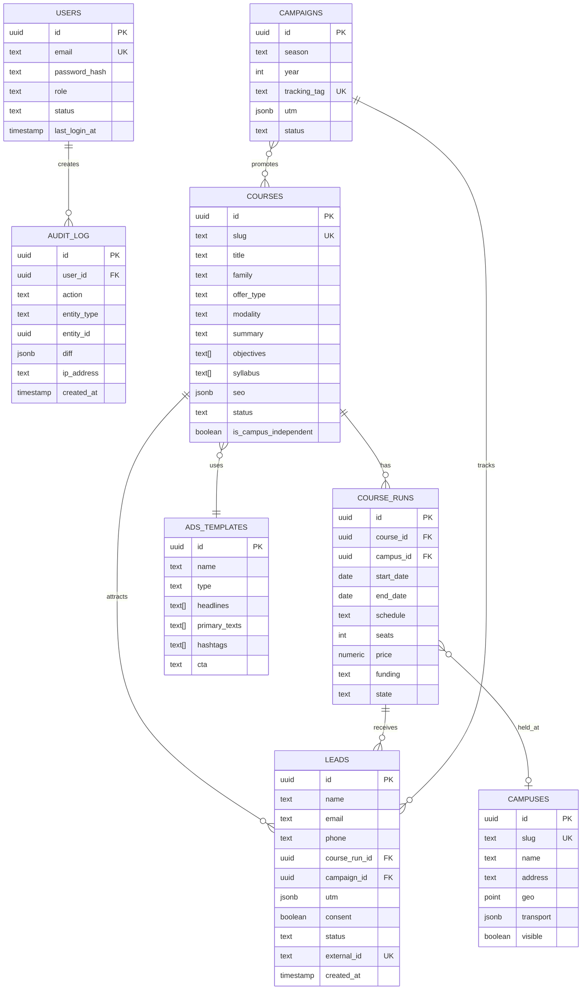

# Database Schema Specification
# CEPComunicacion v2 - PostgreSQL 16+

**Version:** 1.0.0
**Date:** 2025-10-21
**Status:** Phase 0 - Complete
**DBMS:** PostgreSQL 16.0+

---

## Table of Contents

1. [Schema Overview](#1-schema-overview)
2. [Entity Relationship Diagram](#2-entity-relationship-diagram)
3. [Table Definitions](#3-table-definitions)
4. [Indexes Strategy](#4-indexes-strategy)
5. [Constraints & Validations](#5-constraints--validations)
6. [Migration Scripts](#6-migration-scripts)
7. [Seed Data](#7-seed-data)
8. [Query Patterns](#8-query-patterns)

---

## 1. Schema Overview

### 1.1 Collections Summary

| Collection | Purpose | Row Estimate (Year 1) | Growth Rate |
|------------|---------|------------------------|-------------|
| `users` | Authentication & RBAC | 20-30 | Low (manual creation) |
| `campuses` | Physical locations (sedes) | 5-10 | Very low |
| `courses` | Base course catalog | 100-200 | Medium (1-2/week) |
| `course_runs` | Scheduled convocations | 500-1000 | High (5-10/week) |
| `cycles` | Professional training (FP) | 20-50 | Low |
| `campaigns` | Marketing campaigns | 50-100 | Medium (seasonal) |
| `ads_templates` | LLM generation templates | 10-20 | Very low |
| `leads` | Prospective students | 10,000-20,000 | High (100-200/week) |
| `blog_posts` | Blog content | 50-100 | Low (1-2/week) |
| `pages` | Static pages (legal, about) | 10-20 | Very low |
| `settings` | Global configuration | 1 | None (singleton) |
| `events` | Analytics tracking | 500,000-1M | Very high (real-time) |
| `audit_log` | Change tracking | 50,000-100,000 | High |

**Total Tables:** 13

### 1.2 Naming Conventions

- **Tables:** Plural snake_case (e.g., `course_runs`, `ads_templates`)
- **Columns:** Snake_case (e.g., `start_date`, `is_campus_independent`)
- **Indexes:** `idx_{table}_{column(s)}` (e.g., `idx_courses_slug`)
- **Foreign Keys:** `fk_{table}_{referenced_table}` (e.g., `fk_course_runs_courses`)
- **Constraints:** `chk_{table}_{description}` (e.g., `chk_course_runs_dates`)

### 1.3 Data Types Standards

| PostgreSQL Type | Use Case | Example |
|-----------------|----------|---------|
| `uuid` | Primary keys | `id uuid DEFAULT gen_random_uuid()` |
| `text` | Unlimited text (slug, title, content) | `slug text NOT NULL UNIQUE` |
| `varchar(n)` | Limited strings | `phone varchar(20)` |
| `int` / `bigint` | Counters, IDs | `seats int` |
| `numeric(p,s)` | Money | `price numeric(10,2)` |
| `boolean` | Flags | `visible boolean DEFAULT true` |
| `timestamp` | Dates with time | `created_at timestamp DEFAULT now()` |
| `date` | Dates only | `start_date date` |
| `jsonb` | Semi-structured data | `utm jsonb` |
| `text[]` | Arrays | `objectives text[]` |
| `point` | Geo coordinates | `geo point` |

---

## 2. Entity Relationship Diagram

### 2.1 Core ERD (Mermaid)



### 2.2 Relationship Types

| Relationship | Type | Constraint | Notes |
|--------------|------|------------|-------|
| Courses → CourseRuns | 1:N | CASCADE on delete | Deleting course deletes convocations |
| Campuses → CourseRuns | 1:N | RESTRICT on delete | Cannot delete campus with active runs |
| CourseRuns → Leads | 1:N | RESTRICT on delete | Cannot delete run with leads |
| Campaigns → Leads | 1:N | SET NULL on delete | Lead keeps record but campaign_id nulled |
| Courses ↔ Campaigns | N:M | Via `campaign_courses` junction table | Many-to-many |
| AdsTemplates → Courses | 1:N | SET NULL on delete | Course loses template reference |
| Users → AuditLog | 1:N | RESTRICT on delete | Keep audit trail |

---

## 3. Table Definitions

### 3.1 Users (Authentication & RBAC)

```sql
CREATE TABLE users (
    id uuid PRIMARY KEY DEFAULT gen_random_uuid(),
    email text NOT NULL UNIQUE,
    password_hash text NOT NULL, -- bcrypt, 12 rounds
    role text NOT NULL CHECK (role IN ('admin', 'gestor', 'marketing', 'asesor', 'lectura')),
    name text,
    two_fa_enabled boolean DEFAULT false,
    two_fa_secret text, -- TOTP secret (encrypted)
    status text DEFAULT 'active' CHECK (status IN ('active', 'suspended')),
    last_login_at timestamp,
    created_at timestamp DEFAULT now(),
    updated_at timestamp DEFAULT now()
);

CREATE INDEX idx_users_email ON users(email);
CREATE INDEX idx_users_role ON users(role);
CREATE INDEX idx_users_status ON users(status);

COMMENT ON TABLE users IS 'Admin users with role-based access control';
COMMENT ON COLUMN users.password_hash IS 'bcrypt hash with 12 rounds';
COMMENT ON COLUMN users.role IS 'Admin: full access, Gestor: courses, Marketing: campaigns, Asesor: leads, Lectura: read-only';
```

### 3.2 Campuses (Sedes)

```sql
CREATE TABLE campuses (
    id uuid PRIMARY KEY DEFAULT gen_random_uuid(),
    slug text NOT NULL UNIQUE,
    name text NOT NULL,
    address text,
    city text,
    province text,
    zip text,
    geo point, -- (latitude, longitude)
    transport text[], -- ["Bus 15", "Metro L3", "Parking available"]
    contact_phone text,
    contact_email text,
    opening_hours jsonb, -- {"monday": "09:00-21:00", "tuesday": "09:00-21:00", ...}
    visible boolean DEFAULT true,
    created_at timestamp DEFAULT now(),
    updated_at timestamp DEFAULT now()
);

CREATE INDEX idx_campuses_slug ON campuses(slug);
CREATE INDEX idx_campuses_geo ON campuses USING GIST(geo); -- Spatial index for nearby searches
CREATE INDEX idx_campuses_visible ON campuses(visible);

COMMENT ON TABLE campuses IS 'Physical locations (sedes) where courses are held';
COMMENT ON COLUMN campuses.geo IS 'Geographic coordinates for Google Maps integration';
```

### 3.3 Courses (Base Course Catalog)

```sql
CREATE TABLE courses (
    id uuid PRIMARY KEY DEFAULT gen_random_uuid(),
    slug text NOT NULL UNIQUE,
    title text NOT NULL,
    subtitle text,
    family text CHECK (family IN ('sanidad', 'estetica', 'veterinaria', 'logistica', 'administracion', 'bienestar', 'otros')),
    offer_type text NOT NULL CHECK (offer_type IN ('telematico', 'ocupados', 'desempleados', 'privados', 'ciclo-medio', 'ciclo-superior')),
    modality text NOT NULL CHECK (modality IN ('presencial', 'semipresencial', 'telematico')),
    summary text NOT NULL CHECK (char_length(summary) BETWEEN 160 AND 320),
    objectives text[] CHECK (array_length(objectives, 1) BETWEEN 3 AND 8),
    syllabus text[] CHECK (array_length(syllabus, 1) BETWEEN 6 AND 16),
    requirements text[],
    outcomes text[], -- Job opportunities
    benefits text[], -- Checklist items
    duration_hours int,
    docs jsonb, -- [{name, url, size}]
    cover_image jsonb, -- {url, alt, width, height}
    faqs jsonb, -- [{question, answer}]
    is_campus_independent boolean DEFAULT false, -- true for telemático courses
    seo jsonb, -- {title, description, keywords[], ogImage}
    ads_template_id uuid REFERENCES ads_templates(id) ON DELETE SET NULL,
    status text DEFAULT 'draft' CHECK (status IN ('draft', 'review', 'published', 'archived')),
    created_at timestamp DEFAULT now(),
    updated_at timestamp DEFAULT now(),
    published_at timestamp
);

CREATE INDEX idx_courses_slug ON courses(slug);
CREATE INDEX idx_courses_offer_type ON courses(offer_type);
CREATE INDEX idx_courses_modality ON courses(modality);
CREATE INDEX idx_courses_status ON courses(status);
CREATE INDEX idx_courses_family ON courses(family);
CREATE INDEX idx_courses_published_at ON courses(published_at) WHERE status = 'published';

-- Full-text search index
CREATE INDEX idx_courses_title_trgm ON courses USING gin (title gin_trgm_ops);
CREATE INDEX idx_courses_summary_trgm ON courses USING gin (summary gin_trgm_ops);

COMMENT ON TABLE courses IS 'Base course catalog with all course metadata';
COMMENT ON COLUMN courses.summary IS 'Must be between 160-320 characters for SEO';
COMMENT ON COLUMN courses.is_campus_independent IS 'true if course is fully online (telemático)';
```

### 3.4 Course Runs (Convocatorias)

```sql
CREATE TABLE course_runs (
    id uuid PRIMARY KEY DEFAULT gen_random_uuid(),
    course_id uuid NOT NULL REFERENCES courses(id) ON DELETE CASCADE,
    campus_id uuid REFERENCES campuses(id) ON DELETE RESTRICT,
    start_date date NOT NULL,
    end_date date,
    schedule text, -- "Lunes y Miércoles 18:00-21:00"
    seats int,
    price numeric(10, 2), -- For private courses
    funding text CHECK (funding IN ('SEPE', 'SCE', 'Privado', 'Mixto')),
    state text DEFAULT 'abierta' CHECK (state IN ('abierta', 'lista_espera', 'cerrada', 'planificada')),
    lead_form jsonb, -- Custom form fields if needed
    attachments jsonb, -- [{name, url}]
    notes text,
    created_at timestamp DEFAULT now(),
    updated_at timestamp DEFAULT now(),

    CONSTRAINT chk_course_runs_dates CHECK (end_date IS NULL OR start_date <= end_date),
    CONSTRAINT chk_course_runs_campus CHECK (
        (SELECT is_campus_independent FROM courses WHERE id = course_id) = true
        OR campus_id IS NOT NULL
    )
);

CREATE INDEX idx_course_runs_course_id ON course_runs(course_id);
CREATE INDEX idx_course_runs_campus_id ON course_runs(campus_id);
CREATE INDEX idx_course_runs_start_date ON course_runs(start_date);
CREATE INDEX idx_course_runs_state ON course_runs(state);
CREATE INDEX idx_course_runs_active ON course_runs(start_date, state) WHERE state = 'abierta';

COMMENT ON TABLE course_runs IS 'Scheduled course offerings (convocatorias)';
COMMENT ON CONSTRAINT chk_course_runs_dates ON course_runs IS 'End date must be after start date';
COMMENT ON CONSTRAINT chk_course_runs_campus ON course_runs IS 'Campus required unless course is campus-independent';
```

### 3.5 Cycles (Ciclos Formativos FP)

```sql
CREATE TABLE cycles (
    id uuid PRIMARY KEY DEFAULT gen_random_uuid(),
    slug text NOT NULL UNIQUE,
    title text NOT NULL,
    level text NOT NULL CHECK (level IN ('medio', 'superior')),
    modules jsonb, -- [{title, contents: []}]
    official_requirements text[],
    fct_hours int, -- Formación en Centros de Trabajo (practical hours)
    outcomes text[],
    docs jsonb,
    seo jsonb,
    status text DEFAULT 'draft' CHECK (status IN ('draft', 'review', 'published', 'archived')),
    created_at timestamp DEFAULT now(),
    updated_at timestamp DEFAULT now()
);

CREATE INDEX idx_cycles_slug ON cycles(slug);
CREATE INDEX idx_cycles_level ON cycles(level);
CREATE INDEX idx_cycles_status ON cycles(status);

COMMENT ON TABLE cycles IS 'Formación Profesional - Ciclos Medio and Superior';
COMMENT ON COLUMN cycles.fct_hours IS 'Required practical hours in companies';
```

### 3.6 Campaigns (Marketing Campaigns)

```sql
CREATE TABLE campaigns (
    id uuid PRIMARY KEY DEFAULT gen_random_uuid(),
    season text CHECK (season IN ('invierno', 'primavera', 'verano', 'otono')),
    year int NOT NULL,
    status text DEFAULT 'planificada' CHECK (status IN ('planificada', 'activa', 'pausada', 'finalizada')),
    tracking_tag text NOT NULL UNIQUE, -- Format: {season}-{year}-{slug}
    utm jsonb NOT NULL, -- {source, medium, campaign, content, term}
    pixel_ids jsonb, -- {meta: "123456", ...}
    mailchimp_list text,
    created_at timestamp DEFAULT now(),
    updated_at timestamp DEFAULT now()
);

-- Many-to-many relationship with courses
CREATE TABLE campaign_courses (
    campaign_id uuid REFERENCES campaigns(id) ON DELETE CASCADE,
    course_id uuid REFERENCES courses(id) ON DELETE CASCADE,
    PRIMARY KEY (campaign_id, course_id)
);

CREATE INDEX idx_campaigns_tracking_tag ON campaigns(tracking_tag);
CREATE INDEX idx_campaigns_season_year ON campaigns(season, year);
CREATE INDEX idx_campaigns_status ON campaigns(status);
CREATE INDEX idx_campaign_courses_campaign_id ON campaign_courses(campaign_id);
CREATE INDEX idx_campaign_courses_course_id ON campaign_courses(course_id);

COMMENT ON TABLE campaigns IS 'Marketing campaigns with UTM tracking';
COMMENT ON COLUMN campaigns.tracking_tag IS 'Auto-generated from season-year-course slug';
```

### 3.7 Ads Templates (LLM Generation)

```sql
CREATE TABLE ads_templates (
    id uuid PRIMARY KEY DEFAULT gen_random_uuid(),
    name text NOT NULL,
    type text NOT NULL CHECK (type IN ('telematico', 'ocupados', 'desempleados', 'privados', 'ciclo')),
    headlines text[] NOT NULL CHECK (array_length(headlines, 1) BETWEEN 3 AND 5),
    primary_texts text[] NOT NULL CHECK (array_length(primary_texts, 1) BETWEEN 3 AND 5),
    descriptions text[],
    hashtags text[],
    cta text CHECK (cta IN ('Más información', 'Solicitar información', 'Inscríbete ahora', 'Reserva tu plaza')),
    policy_notes text, -- Compliance notes for Meta Ads
    pixel_events text[], -- ["Lead", "CompleteRegistration"]
    created_at timestamp DEFAULT now(),
    updated_at timestamp DEFAULT now()
);

CREATE INDEX idx_ads_templates_type ON ads_templates(type);

COMMENT ON TABLE ads_templates IS 'Templates for LLM-generated Meta Ads';
COMMENT ON COLUMN ads_templates.headlines IS 'Max 40 characters per headline';
COMMENT ON COLUMN ads_templates.primary_texts IS 'Max 125 characters per primary text';
```

### 3.8 Leads (Prospective Students)

```sql
CREATE TABLE leads (
    id uuid PRIMARY KEY DEFAULT gen_random_uuid(),
    name text NOT NULL,
    email text NOT NULL,
    phone text,
    source text DEFAULT 'meta' CHECK (source IN ('meta', 'seo', 'direct', 'referral', 'other')),
    utm jsonb, -- {source, medium, campaign, content, term}
    campaign_id uuid REFERENCES campaigns(id) ON DELETE SET NULL,
    course_run_id uuid NOT NULL REFERENCES course_runs(id) ON DELETE RESTRICT,
    consent boolean NOT NULL DEFAULT false,
    consent_text text, -- Version of privacy policy accepted
    consent_ip text, -- IP address when consent given
    consent_timestamp timestamp,
    status text DEFAULT 'new' CHECK (status IN ('new', 'contacted', 'qualified', 'enrolled', 'lost')),
    notes text,
    external_id text UNIQUE, -- For Meta webhook idempotency
    created_at timestamp DEFAULT now(),
    updated_at timestamp DEFAULT now(),

    CONSTRAINT chk_leads_consent CHECK (consent = true)
);

CREATE INDEX idx_leads_course_run_id ON leads(course_run_id);
CREATE INDEX idx_leads_campaign_id ON leads(campaign_id);
CREATE INDEX idx_leads_status ON leads(status);
CREATE INDEX idx_leads_email ON leads(email);
CREATE INDEX idx_leads_external_id ON leads(external_id) WHERE external_id IS NOT NULL;
CREATE INDEX idx_leads_created_at ON leads(created_at DESC);

COMMENT ON TABLE leads IS 'Prospective students who submitted lead forms';
COMMENT ON COLUMN leads.external_id IS 'Unique ID from Meta Ads for deduplication';
COMMENT ON CONSTRAINT chk_leads_consent ON leads IS 'RGPD: consent must be true';
```

### 3.9 Blog Posts

```sql
CREATE TABLE blog_posts (
    id uuid PRIMARY KEY DEFAULT gen_random_uuid(),
    slug text NOT NULL UNIQUE,
    title text NOT NULL,
    excerpt text,
    content text, -- Rich text (HTML or Markdown)
    cover_image jsonb,
    tags text[],
    author_id uuid REFERENCES users(id) ON DELETE SET NULL,
    status text DEFAULT 'draft' CHECK (status IN ('draft', 'review', 'published', 'archived')),
    published_at timestamp,
    created_at timestamp DEFAULT now(),
    updated_at timestamp DEFAULT now()
);

CREATE INDEX idx_blog_posts_slug ON blog_posts(slug);
CREATE INDEX idx_blog_posts_status ON blog_posts(status);
CREATE INDEX idx_blog_posts_published_at ON blog_posts(published_at DESC) WHERE status = 'published';
CREATE INDEX idx_blog_posts_tags ON blog_posts USING gin(tags);

COMMENT ON TABLE blog_posts IS 'Blog articles and news';
```

### 3.10 Pages (Static Content)

```sql
CREATE TABLE pages (
    id uuid PRIMARY KEY DEFAULT gen_random_uuid(),
    slug text NOT NULL UNIQUE,
    title text NOT NULL,
    content text,
    seo jsonb,
    created_at timestamp DEFAULT now(),
    updated_at timestamp DEFAULT now()
);

CREATE INDEX idx_pages_slug ON pages(slug);

COMMENT ON TABLE pages IS 'Static pages (about, privacy, cookies, legal)';
```

### 3.11 Settings (Global Configuration)

```sql
CREATE TABLE settings (
    id uuid PRIMARY KEY DEFAULT gen_random_uuid(),
    branding jsonb, -- {colors, logo, typography}
    seo_defaults jsonb, -- {titleSuffix, ogImageDefault}
    integrations jsonb, -- {ga4Id, metaPixelId, mailchimp, whatsapp, smtp, crm}
    privacy jsonb, -- {policyText, version, cookiePolicy}
    created_at timestamp DEFAULT now(),
    updated_at timestamp DEFAULT now(),

    CONSTRAINT singleton CHECK (id = '00000000-0000-0000-0000-000000000000'::uuid)
);

-- Insert singleton row
INSERT INTO settings (id) VALUES ('00000000-0000-0000-0000-000000000000'::uuid);

COMMENT ON TABLE settings IS 'Global settings (singleton pattern)';
```

### 3.12 Events (Analytics Tracking)

```sql
CREATE TABLE events (
    id uuid PRIMARY KEY DEFAULT gen_random_uuid(),
    type text NOT NULL CHECK (type IN ('page_view', 'click_cta', 'lead_submit', 'form_error', 'course_view')),
    session_id text,
    path text,
    referrer text,
    props jsonb, -- {course, run, campus, device, abVariant}
    utm jsonb,
    created_at timestamp DEFAULT now()
);

CREATE INDEX idx_events_type ON events(type);
CREATE INDEX idx_events_created_at ON events(created_at DESC);
CREATE INDEX idx_events_path ON events(path);

-- Partition by month for performance
-- CREATE TABLE events_2025_10 PARTITION OF events FOR VALUES FROM ('2025-10-01') TO ('2025-11-01');

COMMENT ON TABLE events IS 'Client-side analytics events (partitioned by month)';
```

### 3.13 Audit Log

```sql
CREATE TABLE audit_log (
    id uuid PRIMARY KEY DEFAULT gen_random_uuid(),
    user_id uuid REFERENCES users(id) ON DELETE RESTRICT,
    action text NOT NULL CHECK (action IN ('create', 'update', 'delete')),
    entity_type text NOT NULL, -- 'course', 'lead', 'campaign', etc.
    entity_id uuid NOT NULL,
    diff jsonb, -- {before: {...}, after: {...}}
    ip_address text,
    created_at timestamp DEFAULT now()
);

CREATE INDEX idx_audit_log_user_id ON audit_log(user_id);
CREATE INDEX idx_audit_log_entity ON audit_log(entity_type, entity_id);
CREATE INDEX idx_audit_log_created_at ON audit_log(created_at DESC);

COMMENT ON TABLE audit_log IS 'Audit trail for all mutations (RGPD compliance)';
COMMENT ON COLUMN audit_log.diff IS 'Before/after values for update actions';
```

---

## 4. Indexes Strategy

### 4.1 Index Types Used

| Index Type | Purpose | Example |
|------------|---------|---------|
| **B-tree** (default) | Exact matches, range queries | `idx_courses_slug`, `idx_leads_created_at` |
| **GIN** | Full-text search, array/JSONB | `idx_courses_title_trgm`, `idx_blog_posts_tags` |
| **GIST** | Spatial data | `idx_campuses_geo` |
| **Partial** | Index subset of rows | `idx_course_runs_active WHERE state = 'abierta'` |

### 4.2 Critical Indexes (< 50ms Query Target)

```sql
-- Leads dashboard query
CREATE INDEX idx_leads_dashboard ON leads(status, course_run_id, created_at DESC);

-- Course list query
CREATE INDEX idx_courses_list ON courses(status, offer_type, modality) WHERE status = 'published';

-- Campaign performance query
CREATE INDEX idx_leads_campaign_stats ON leads(campaign_id, status, created_at);
```

### 4.3 Full-Text Search Setup

```sql
-- Install pg_trgm extension
CREATE EXTENSION IF NOT EXISTS pg_trgm;

-- Trigram indexes for fuzzy search
CREATE INDEX idx_courses_title_trgm ON courses USING gin (title gin_trgm_ops);
CREATE INDEX idx_courses_summary_trgm ON courses USING gin (summary gin_trgm_ops);
CREATE INDEX idx_campuses_name_trgm ON campuses USING gin (name gin_trgm_ops);

-- Example query:
-- SELECT * FROM courses WHERE title ILIKE '%enferm%' ORDER BY similarity(title, 'enfermería') DESC LIMIT 10;
```

---

## 5. Constraints & Validations

### 5.1 Check Constraints

```sql
-- Course summary length
ALTER TABLE courses ADD CONSTRAINT chk_courses_summary_length
    CHECK (char_length(summary) BETWEEN 160 AND 320);

-- Lead consent required (RGPD)
ALTER TABLE leads ADD CONSTRAINT chk_leads_consent
    CHECK (consent = true);

-- Course run dates logical
ALTER TABLE course_runs ADD CONSTRAINT chk_course_runs_dates
    CHECK (end_date IS NULL OR start_date <= end_date);

-- Campaign tracking tag format
ALTER TABLE campaigns ADD CONSTRAINT chk_campaigns_tracking_tag_format
    CHECK (tracking_tag ~ '^[a-z]+-\d{4}-[a-z0-9-]+$');
```

### 5.2 Foreign Key Cascade Rules

| From Table | To Table | ON DELETE | ON UPDATE | Rationale |
|------------|----------|-----------|-----------|-----------|
| course_runs | courses | CASCADE | CASCADE | Runs belong to course |
| course_runs | campuses | RESTRICT | CASCADE | Prevent orphaned runs |
| leads | course_runs | RESTRICT | CASCADE | Keep lead history |
| leads | campaigns | SET NULL | CASCADE | Keep lead, lose campaign link |
| audit_log | users | RESTRICT | CASCADE | Preserve audit trail |

---

## 6. Migration Scripts

### 6.1 Initial Migration (001_create_tables.sql)

```sql
-- File: migrations/001_create_tables.sql
-- Description: Initial schema creation
-- Author: SOLARIA AGENCY
-- Date: 2025-10-21

BEGIN;

-- Enable UUID extension
CREATE EXTENSION IF NOT EXISTS "pgcrypto";

-- Enable trigram extension for full-text search
CREATE EXTENSION IF NOT EXISTS "pg_trgm";

-- Create all tables (copy from Section 3 above)
-- ...

-- Create updated_at trigger function
CREATE OR REPLACE FUNCTION update_updated_at_column()
RETURNS TRIGGER AS $$
BEGIN
    NEW.updated_at = now();
    RETURN NEW;
END;
$$ LANGUAGE plpgsql;

-- Apply trigger to all tables with updated_at
DO $$
DECLARE
    t text;
BEGIN
    FOR t IN
        SELECT table_name
        FROM information_schema.columns
        WHERE column_name = 'updated_at' AND table_schema = 'public'
    LOOP
        EXECUTE format('CREATE TRIGGER trigger_update_%I_updated_at BEFORE UPDATE ON %I FOR EACH ROW EXECUTE FUNCTION update_updated_at_column();', t, t);
    END LOOP;
END;
$$ LANGUAGE plpgsql;

COMMIT;
```

### 6.2 Seed Data Migration (002_seed_data.sql)

```sql
-- File: migrations/002_seed_data.sql
-- Description: Initial seed data (roles, settings, test campuses)
-- Author: SOLARIA AGENCY
-- Date: 2025-10-21

BEGIN;

-- Insert settings singleton
INSERT INTO settings (id, branding, seo_defaults, integrations, privacy)
VALUES (
    '00000000-0000-0000-0000-000000000000'::uuid,
    '{"colors": {"primary": "#2c3e50", "secondary": "#3498db", "accent": "#e74c3c"}}'::jsonb,
    '{"titleSuffix": " | CEP Formación", "ogImageDefault": "/og-image.jpg"}'::jsonb,
    '{"ga4Id": null, "metaPixelId": null, "mailchimp": {}, "whatsapp": {}, "smtp": {}}'::jsonb,
    '{"version": "1.0", "policyText": "..."}'::jsonb
);

-- Insert admin user (password: "AdminCEP2025!")
INSERT INTO users (email, password_hash, role, name, status)
VALUES (
    'admin@cepcomunicacion.com',
    '$2b$12$abcdefghijklmnopqrstuvwxyz1234567890ABCDEFGH', -- Replace with actual bcrypt hash
    'admin',
    'Admin CEP',
    'active'
);

-- Insert sample campuses
INSERT INTO campuses (slug, name, city, province, geo, transport, contact_phone, contact_email, visible)
VALUES
    ('santa-cruz', 'Santa Cruz de Tenerife', 'Santa Cruz de Tenerife', 'Santa Cruz de Tenerife',
     point(28.4636296, -16.2518467),
     ARRAY['Bus 15, 20, 30', 'Tranvía: Hospital Universitario'],
     '+34 922 123 456', 'santacruz@cepcomunicacion.com', true),
    ('la-laguna', 'San Cristóbal de La Laguna', 'La Laguna', 'Santa Cruz de Tenerife',
     point(28.4853437, -16.3154368),
     ARRAY['Bus 014, 015', 'Tranvía: Trinidad'],
     '+34 922 654 321', 'lalaguna@cepcomunicacion.com', true);

-- Insert sample ads templates
INSERT INTO ads_templates (name, type, headlines, primary_texts, hashtags, cta)
VALUES
    ('Telemático General', 'telematico',
     ARRAY['Fórmate 100% Online | CEP', 'Cursos Telemáticos Certificados', 'Aprende Desde Casa'],
     ARRAY['Aprende a tu ritmo con nuestros cursos 100% online. Certificados oficiales.', 'Formación flexible adaptada a tu horario. Inscríbete ahora.'],
     ARRAY['#FormaciónOnline', '#CursosCertificados', '#AprendeEnCasa'],
     'Solicitar información'),
    ('Desempleados SEPE', 'desempleados',
     ARRAY['Cursos Gratuitos SEPE | CEP', 'Fórmate Gratis', 'Cursos Subvencionados'],
     ARRAY['Cursos 100% gratuitos subvencionados por el SEPE. Mejora tu empleabilidad.', 'Formación certificada sin coste. Plazas limitadas.'],
     ARRAY['#CursosGratis', '#SEPE', '#Formación'],
     'Más información');

COMMIT;
```

### 6.3 Rollback Script (rollback_001.sql)

```sql
-- File: migrations/rollback_001.sql
-- Description: Rollback initial migration
-- Author: SOLARIA AGENCY
-- Date: 2025-10-21

BEGIN;

-- Drop all tables in reverse dependency order
DROP TABLE IF EXISTS audit_log CASCADE;
DROP TABLE IF EXISTS events CASCADE;
DROP TABLE IF EXISTS settings CASCADE;
DROP TABLE IF EXISTS pages CASCADE;
DROP TABLE IF EXISTS blog_posts CASCADE;
DROP TABLE IF EXISTS leads CASCADE;
DROP TABLE IF EXISTS campaign_courses CASCADE;
DROP TABLE IF EXISTS campaigns CASCADE;
DROP TABLE IF EXISTS ads_templates CASCADE;
DROP TABLE IF EXISTS cycles CASCADE;
DROP TABLE IF EXISTS course_runs CASCADE;
DROP TABLE IF EXISTS courses CASCADE;
DROP TABLE IF EXISTS campuses CASCADE;
DROP TABLE IF EXISTS users CASCADE;

-- Drop trigger function
DROP FUNCTION IF EXISTS update_updated_at_column() CASCADE;

-- Drop extensions (optional, may be used by other schemas)
-- DROP EXTENSION IF EXISTS pg_trgm;
-- DROP EXTENSION IF EXISTS pgcrypto;

COMMIT;
```

---

## 7. Seed Data

### 7.1 Test Data for Development

```sql
-- Insert test courses
INSERT INTO courses (slug, title, family, offer_type, modality, summary, objectives, syllabus, status)
VALUES
    ('auxiliar-enfermeria', 'Auxiliar de Enfermería', 'sanidad', 'desempleados', 'presencial',
     'Curso gratuito subvencionado por el SEPE para formarte como auxiliar de enfermería. Aprende cuidados básicos, higiene hospitalaria y atención al paciente.',
     ARRAY['Conocer técnicas de cuidados básicos', 'Dominar protocolos de higiene', 'Atención integral al paciente'],
     ARRAY['Introducción a la enfermería', 'Anatomía y fisiología', 'Cuidados básicos', 'Higiene y prevención', 'Primeros auxilios', 'Prácticas en centros'],
     'published'),
    ('gestion-administrativa', 'Gestión Administrativa', 'administracion', 'ocupados', 'semipresencial',
     'Curso para trabajadores en activo. Aprende gestión documental, contabilidad básica y herramientas ofimáticas. Compatible con tu horario laboral.',
     ARRAY['Gestión documental eficiente', 'Contabilidad básica', 'Herramientas Office avanzadas'],
     ARRAY['Ofimática avanzada', 'Gestión documental', 'Contabilidad', 'Legislación laboral', 'Atención al cliente', 'Comunicación empresarial'],
     'published');

-- Insert course runs
INSERT INTO course_runs (course_id, campus_id, start_date, seats, funding, state)
SELECT
    c.id,
    (SELECT id FROM campuses WHERE slug = 'santa-cruz'),
    '2025-04-15'::date,
    20,
    'SEPE',
    'abierta'
FROM courses c WHERE c.slug = 'auxiliar-enfermeria';

-- Insert test campaign
INSERT INTO campaigns (season, year, tracking_tag, utm, status)
VALUES
    ('primavera', 2025, 'primavera-2025-auxiliar-enfermeria',
     '{"source": "meta", "medium": "paid", "campaign": "primavera-2025-auxiliar-enfermeria", "content": "sanidad"}'::jsonb,
     'activa');

-- Link campaign to course
INSERT INTO campaign_courses (campaign_id, course_id)
SELECT
    (SELECT id FROM campaigns WHERE tracking_tag = 'primavera-2025-auxiliar-enfermeria'),
    (SELECT id FROM courses WHERE slug = 'auxiliar-enfermeria');
```

---

## 8. Query Patterns

### 8.1 Common Queries (< 50ms target)

#### 8.1.1 Get Published Courses with Active Runs

```sql
SELECT
    c.id,
    c.slug,
    c.title,
    c.summary,
    c.cover_image,
    COUNT(cr.id) AS active_runs
FROM courses c
LEFT JOIN course_runs cr ON cr.course_id = c.id AND cr.state = 'abierta'
WHERE c.status = 'published'
GROUP BY c.id
ORDER BY c.published_at DESC
LIMIT 20;

-- Performance: Uses idx_courses_list + idx_course_runs_active
-- Expected: < 20ms
```

#### 8.1.2 Get Course Detail with Runs and Campus

```sql
SELECT
    c.*,
    json_agg(
        json_build_object(
            'id', cr.id,
            'start_date', cr.start_date,
            'seats', cr.seats,
            'state', cr.state,
            'campus', json_build_object('name', ca.name, 'city', ca.city)
        )
    ) FILTER (WHERE cr.id IS NOT NULL) AS runs
FROM courses c
LEFT JOIN course_runs cr ON cr.course_id = c.id
LEFT JOIN campuses ca ON ca.id = cr.campus_id
WHERE c.slug = $1
GROUP BY c.id;

-- Performance: Uses idx_courses_slug
-- Expected: < 10ms
```

#### 8.1.3 Get Leads for Dashboard (Paginated)

```sql
SELECT
    l.id,
    l.name,
    l.email,
    l.phone,
    l.status,
    l.created_at,
    c.title AS course_title,
    cr.start_date,
    ca.name AS campus_name,
    cm.tracking_tag AS campaign
FROM leads l
JOIN course_runs cr ON cr.id = l.course_run_id
JOIN courses c ON c.id = cr.course_id
LEFT JOIN campuses ca ON ca.id = cr.campus_id
LEFT JOIN campaigns cm ON cm.id = l.campaign_id
WHERE l.status = $1 -- e.g., 'new'
ORDER BY l.created_at DESC
LIMIT 50 OFFSET $2;

-- Performance: Uses idx_leads_dashboard
-- Expected: < 30ms
```

#### 8.1.4 Campaign Performance Stats

```sql
SELECT
    cm.tracking_tag,
    cm.season,
    cm.year,
    COUNT(l.id) AS total_leads,
    COUNT(l.id) FILTER (WHERE l.status = 'enrolled') AS enrolled,
    ROUND(
        COUNT(l.id) FILTER (WHERE l.status = 'enrolled')::numeric /
        NULLIF(COUNT(l.id), 0) * 100, 2
    ) AS conversion_rate
FROM campaigns cm
LEFT JOIN leads l ON l.campaign_id = cm.id
WHERE cm.status = 'activa'
GROUP BY cm.id, cm.tracking_tag, cm.season, cm.year
ORDER BY total_leads DESC;

-- Performance: Uses idx_leads_campaign_stats
-- Expected: < 50ms
```

### 8.2 Complex Queries

#### 8.2.1 Full-Text Search for Courses

```sql
SELECT
    c.id,
    c.slug,
    c.title,
    c.summary,
    similarity(c.title, $1) AS title_similarity,
    similarity(c.summary, $1) AS summary_similarity
FROM courses c
WHERE
    c.status = 'published'
    AND (
        c.title ILIKE '%' || $1 || '%'
        OR c.summary ILIKE '%' || $1 || '%'
    )
ORDER BY
    GREATEST(
        similarity(c.title, $1),
        similarity(c.summary, $1)
    ) DESC
LIMIT 10;

-- Parameter $1: 'enfermería'
-- Performance: Uses idx_courses_title_trgm + idx_courses_summary_trgm
-- Expected: < 100ms
```

#### 8.2.2 Nearby Campuses (Geo Search)

```sql
SELECT
    id,
    name,
    city,
    geo,
    geo <-> point($1, $2) AS distance_km
FROM campuses
WHERE
    visible = true
    AND geo IS NOT NULL
ORDER BY geo <-> point($1, $2) -- Distance operator
LIMIT 5;

-- Parameters: $1 = latitude, $2 = longitude
-- Performance: Uses idx_campuses_geo (GIST)
-- Expected: < 20ms
```

---

## 9. Backup & Restore

### 9.1 Backup Script

```bash
#!/bin/bash
# File: scripts/backup.sh

DATE=$(date +%Y-%m-%d)
BACKUP_DIR="/var/backups/postgres"
DB_NAME="cep"
DB_USER="postgres"

# Create backup directory
mkdir -p "$BACKUP_DIR"

# Dump database
pg_dump -U "$DB_USER" -F c -b -v -f "$BACKUP_DIR/cep_backup_$DATE.dump" "$DB_NAME"

# Compress
gzip "$BACKUP_DIR/cep_backup_$DATE.dump"

# Upload to S3 (optional)
# aws s3 cp "$BACKUP_DIR/cep_backup_$DATE.dump.gz" s3://cepcomunicacion-backups/

# Delete backups older than 30 days
find "$BACKUP_DIR" -name "cep_backup_*.dump.gz" -mtime +30 -delete

echo "Backup completed: cep_backup_$DATE.dump.gz"
```

### 9.2 Restore Script

```bash
#!/bin/bash
# File: scripts/restore.sh

if [ -z "$1" ]; then
    echo "Usage: ./restore.sh <backup_file.dump.gz>"
    exit 1
fi

BACKUP_FILE="$1"
DB_NAME="cep"
DB_USER="postgres"

# Decompress if needed
if [[ "$BACKUP_FILE" == *.gz ]]; then
    gunzip -k "$BACKUP_FILE"
    BACKUP_FILE="${BACKUP_FILE%.gz}"
fi

# Drop and recreate database (CAUTION!)
dropdb -U "$DB_USER" "$DB_NAME"
createdb -U "$DB_USER" "$DB_NAME"

# Restore
pg_restore -U "$DB_USER" -d "$DB_NAME" -v "$BACKUP_FILE"

echo "Restore completed from $BACKUP_FILE"
```

---

## 10. Performance Optimization

### 10.1 Query Analysis

```sql
-- Enable query statistics
CREATE EXTENSION IF NOT EXISTS pg_stat_statements;

-- Find slow queries
SELECT
    query,
    calls,
    mean_exec_time,
    max_exec_time
FROM pg_stat_statements
WHERE mean_exec_time > 100 -- queries slower than 100ms
ORDER BY mean_exec_time DESC
LIMIT 10;

-- Analyze table statistics
ANALYZE courses;
ANALYZE course_runs;
ANALYZE leads;
```

### 10.2 Connection Pooling

**Recommended Settings (PostgreSQL 16):**

```ini
# postgresql.conf
max_connections = 100
shared_buffers = 256MB
effective_cache_size = 1GB
maintenance_work_mem = 64MB
checkpoint_completion_target = 0.9
wal_buffers = 16MB
default_statistics_target = 100
random_page_cost = 1.1
effective_io_concurrency = 200
work_mem = 2621kB
min_wal_size = 1GB
max_wal_size = 4GB
max_worker_processes = 2
max_parallel_workers_per_gather = 1
max_parallel_workers = 2
```

**Application-Level Pooling (Node.js):**

```javascript
// Using pg pool
const pool = new Pool({
  host: 'localhost',
  database: 'cep',
  user: 'postgres',
  password: process.env.PG_PASSWORD,
  port: 5432,
  max: 20, // Maximum connections
  idleTimeoutMillis: 30000,
  connectionTimeoutMillis: 2000,
});
```

---

## 11. Security Considerations

### 11.1 Row-Level Security (RLS)

```sql
-- Enable RLS on sensitive tables
ALTER TABLE leads ENABLE ROW LEVEL SECURITY;

-- Asesores can only see leads assigned to them
CREATE POLICY asesor_leads_policy ON leads
FOR SELECT
TO asesor_role
USING (
    EXISTS (
        SELECT 1 FROM users
        WHERE users.id = current_user_id()
        AND users.role = 'asesor'
    )
    AND assigned_to = current_user_id()
);

-- Marketing can see all leads but not edit certain fields
CREATE POLICY marketing_leads_policy ON leads
FOR UPDATE
TO marketing_role
USING (true)
WITH CHECK (
    -- Can only update notes and status, not email/phone
    OLD.email = NEW.email AND OLD.phone = NEW.phone
);
```

### 11.2 Encryption at Rest (Optional)

```sql
-- Enable pgcrypto for field-level encryption
CREATE EXTENSION IF NOT EXISTS pgcrypto;

-- Encrypt sensitive fields
-- Example: Encrypt 2FA secrets
UPDATE users
SET two_fa_secret = pgp_sym_encrypt(two_fa_secret, 'encryption_key')
WHERE two_fa_enabled = true;

-- Decrypt when reading
SELECT
    id,
    email,
    pgp_sym_decrypt(two_fa_secret::bytea, 'encryption_key') AS two_fa_secret
FROM users
WHERE id = $1;
```

---

## Conclusion

This database schema is designed for:

- **Data Integrity:** Foreign keys, constraints, validations
- **Performance:** Strategic indexes, query optimization
- **Scalability:** Partitioning strategy for high-volume tables
- **Security:** RLS, audit logging, RGPD compliance
- **Maintainability:** Clear naming, comments, migration scripts

**Next Steps:**
1. Review and approve schema
2. Run migration scripts in dev environment
3. Test query performance with sample data
4. Implement in Phase 1 development

---

**Document Control**

| Version | Date | Author | Changes |
|---------|------|--------|---------|
| 1.0.0 | 2025-10-21 | Claude AI (SOLARIA AGENCY) | Initial database schema specification |
