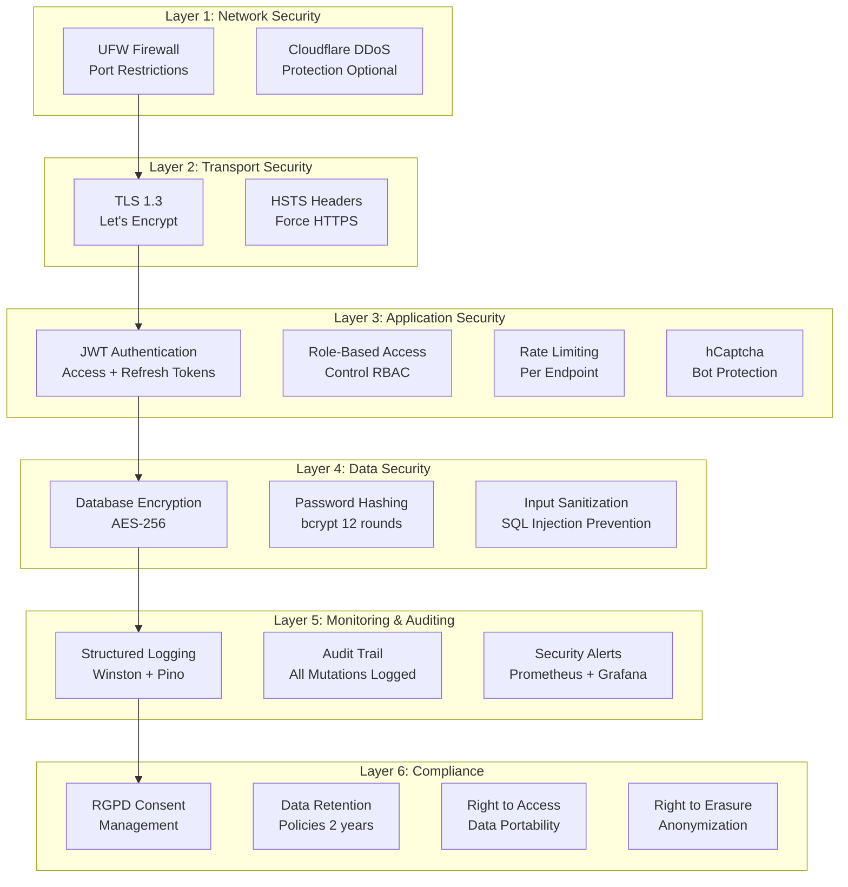
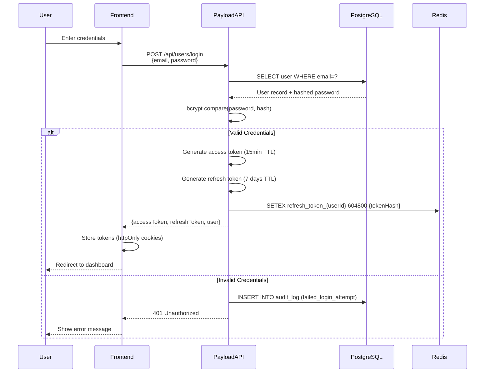
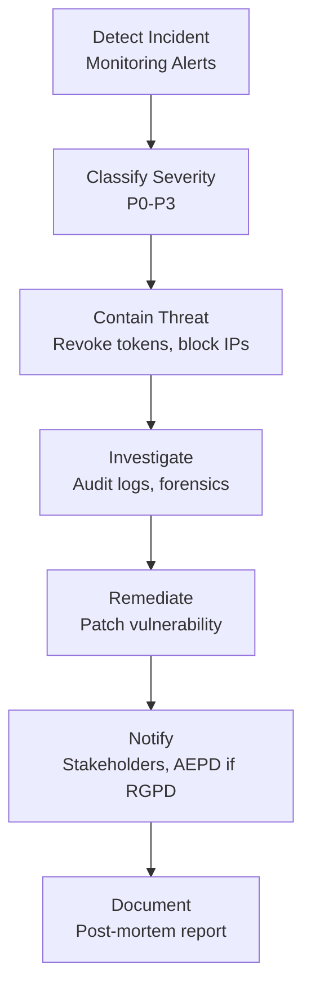

# Security & RGPD Compliance Specification

**Project:** CEPComunicacion.com v2 - Plataforma Integral de Gestión Formativa
**Document:** Security & RGPD/GDPR Compliance Technical Specification
**Version:** 1.0.0
**Date:** 2025-10-21
**Author:** SOLARIA AGENCY - Dirección de Tecnología
**Status:** ✅ Complete

---

## Table of Contents

1. [Executive Summary](#1-executive-summary)
2. [Security Architecture Overview](#2-security-architecture-overview)
3. [Authentication System](#3-authentication-system)
4. [Authorization & RBAC](#4-authorization--rbac)
5. [Password Security](#5-password-security)
6. [Two-Factor Authentication (2FA)](#6-two-factor-authentication-2fa)
7. [Rate Limiting & DDoS Protection](#7-rate-limiting--ddos-protection)
8. [CAPTCHA Integration](#8-captcha-integration)
9. [RGPD/GDPR Compliance](#9-rgpdgdpr-compliance)
10. [Audit Logging](#10-audit-logging)
11. [Data Encryption](#11-data-encryption)
12. [Security Headers](#12-security-headers)
13. [API Security](#13-api-security)
14. [Penetration Testing Checklist](#14-penetration-testing-checklist)
15. [Incident Response Plan](#15-incident-response-plan)
16. [Acceptance Criteria](#16-acceptance-criteria)

---

## 1. Executive Summary

### 1.1 Purpose

This document defines the **comprehensive security architecture** and **RGPD/GDPR compliance strategy** for CEPComunicacion v2. Security is not an afterthought—it's baked into every layer from day one.

### 1.2 Security Principles

1. **Defense in Depth**: Multiple layers of security controls
2. **Least Privilege**: Users/processes get minimum necessary permissions
3. **Zero Trust**: Verify explicitly, never trust implicitly
4. **Privacy by Design**: RGPD compliance built into architecture
5. **Continuous Monitoring**: Real-time threat detection and audit logging
6. **Encryption Everywhere**: Data at rest and in transit protected

### 1.3 Compliance Requirements

- **RGPD (Reglamento General de Protección de Datos)**: Spanish GDPR implementation
- **LOPDGDD**: Spanish Organic Law 3/2018 on Data Protection
- **LSSI-CE**: Spanish Law on Information Society Services
- **ePrivacy Directive**: Cookie consent and electronic communications

### 1.4 Threat Model

**Primary Threats Addressed:**

1. **Unauthorized Access**: Stolen credentials, brute force attacks
2. **Data Breaches**: SQL injection, XSS, CSRF attacks
3. **RGPD Violations**: Unauthorized data processing, missing consent
4. **DDoS Attacks**: Service disruption via flooding
5. **Privilege Escalation**: Users gaining unauthorized permissions
6. **Man-in-the-Middle**: Traffic interception without HTTPS
7. **Session Hijacking**: Cookie theft, session fixation
8. **Insider Threats**: Malicious or negligent employees

---

## 2. Security Architecture Overview

### 2.1 Defense-in-Depth Layers



### 2.2 Security Zones

| Zone | Components | Trust Level | Access Control |
|------|-----------|-------------|----------------|
| **Public Zone** | Frontend (React), Static Assets | Untrusted | Read-only, CAPTCHA on forms |
| **DMZ** | Nginx Reverse Proxy, SSL Termination | Low Trust | Rate limiting, WAF rules |
| **Application Zone** | Payload CMS API, Workers | Medium Trust | JWT auth, RBAC |
| **Data Zone** | PostgreSQL, Redis | High Trust | Localhost only, encrypted |
| **Admin Zone** | Database Admin Tools, Logs | Highest Trust | VPN + 2FA required |

---

## 3. Authentication System

### 3.1 JWT-Based Authentication

**Architecture:**



### 3.2 Token Configuration

**Access Token (Short-Lived):**

```typescript
// packages/types/src/auth.ts

export interface AccessTokenPayload {
  userId: string;
  email: string;
  role: UserRole;
  permissions: string[];
  iat: number; // Issued at
  exp: number; // Expires at (15 minutes from iat)
}

// Example JWT payload
{
  "userId": "550e8400-e29b-41d4-a716-446655440000",
  "email": "gestor@cepformacion.com",
  "role": "gestor",
  "permissions": ["courses:read", "courses:write", "course-runs:read", "course-runs:write"],
  "iat": 1729504800,
  "exp": 1729505700 // 15 minutes later
}
```

**Refresh Token (Long-Lived):**

```typescript
export interface RefreshTokenPayload {
  userId: string;
  tokenFamily: string; // UUID for token rotation detection
  iat: number;
  exp: number; // Expires at (7 days from iat)
}

// Stored in Redis with key: refresh_token_{userId}_{tokenFamily}
// Value: SHA-256 hash of the refresh token
```

### 3.3 Token Rotation Strategy

**Automatic Rotation (Refresh Token Rotation):**

```typescript
// apps/cms/src/auth/refreshToken.ts

export async function refreshAccessToken(refreshToken: string): Promise<AuthResponse> {
  // 1. Verify refresh token signature
  const payload = jwt.verify(refreshToken, process.env.REFRESH_TOKEN_SECRET!) as RefreshTokenPayload;

  // 2. Check if token exists in Redis (not revoked)
  const tokenHash = crypto.createHash('sha256').update(refreshToken).digest('hex');
  const storedHash = await redis.get(`refresh_token_${payload.userId}_${payload.tokenFamily}`);

  if (!storedHash || storedHash !== tokenHash) {
    // Possible token reuse detected - revoke entire token family
    await redis.del(`refresh_token_${payload.userId}_*`);
    throw new Error('Token reuse detected - all sessions revoked');
  }

  // 3. Generate new access token
  const user = await getUserById(payload.userId);
  const newAccessToken = generateAccessToken(user);

  // 4. Generate new refresh token (rotation)
  const newRefreshToken = generateRefreshToken(user, payload.tokenFamily);
  const newTokenHash = crypto.createHash('sha256').update(newRefreshToken).digest('hex');

  // 5. Replace old refresh token in Redis
  await redis.setex(
    `refresh_token_${payload.userId}_${payload.tokenFamily}`,
    7 * 24 * 60 * 60, // 7 days
    newTokenHash
  );

  return {
    accessToken: newAccessToken,
    refreshToken: newRefreshToken,
    user: sanitizeUser(user),
  };
}
```

### 3.4 Session Management

**Concurrent Session Control:**

```typescript
// Maximum 5 active sessions per user
const MAX_SESSIONS_PER_USER = 5;

// On login, check active sessions
const activeSessionsCount = await redis.scard(`user_sessions_${userId}`);

if (activeSessionsCount >= MAX_SESSIONS_PER_USER) {
  // Remove oldest session
  const oldestSession = await redis.spop(`user_sessions_${userId}`);
  await redis.del(`refresh_token_${userId}_${oldestSession}`);
}

// Add new session
await redis.sadd(`user_sessions_${userId}`, tokenFamily);
```

### 3.5 Logout & Token Revocation

**Single Session Logout:**

```typescript
export async function logout(userId: string, tokenFamily: string): Promise<void> {
  await redis.del(`refresh_token_${userId}_${tokenFamily}`);
  await redis.srem(`user_sessions_${userId}`, tokenFamily);
}
```

**Global Logout (All Sessions):**

```typescript
export async function logoutAllSessions(userId: string): Promise<void> {
  const sessions = await redis.smembers(`user_sessions_${userId}`);

  const pipeline = redis.pipeline();
  sessions.forEach(tokenFamily => {
    pipeline.del(`refresh_token_${userId}_${tokenFamily}`);
  });
  pipeline.del(`user_sessions_${userId}`);

  await pipeline.exec();
}
```

---

## 4. Authorization & RBAC

### 4.1 Role Definitions

**5 User Roles:**

```typescript
// packages/types/src/rbac.ts

export type UserRole =
  | 'admin'
  | 'gestor'
  | 'marketing'
  | 'asesor'
  | 'lectura';

export interface Role {
  name: UserRole;
  description: string;
  permissions: Permission[];
}

export const ROLES: Record<UserRole, Role> = {
  admin: {
    name: 'admin',
    description: 'Full system access, user management, settings',
    permissions: ['*'], // Wildcard = all permissions
  },
  gestor: {
    name: 'gestor',
    description: 'Academic manager - courses, curricula, convocations',
    permissions: [
      'courses:read',
      'courses:write',
      'courses:delete',
      'course-runs:read',
      'course-runs:write',
      'course-runs:delete',
      'cycles:read',
      'cycles:write',
      'campuses:read',
      'blog:read',
      'blog:write',
      'pages:read',
      'pages:write',
    ],
  },
  marketing: {
    name: 'marketing',
    description: 'Marketing team - campaigns, ads, analytics (read), lead assignment',
    permissions: [
      'campaigns:read',
      'campaigns:write',
      'campaigns:delete',
      'ads-templates:read',
      'ads-templates:write',
      'leads:read',
      'leads:update', // Can assign leads to asesores
      'courses:read', // Read-only for campaign creation
      'course-runs:read',
      'analytics:read',
    ],
  },
  asesor: {
    name: 'asesor',
    description: 'Sales advisor - lead follow-up, notes, status updates',
    permissions: [
      'leads:read', // Only assigned leads (row-level security)
      'leads:update', // Can update notes, status, tags
      'courses:read',
      'course-runs:read',
      'campuses:read',
    ],
  },
  lectura: {
    name: 'lectura',
    description: 'Read-only access for all collections',
    permissions: [
      '*:read', // All read permissions, no write/delete
    ],
  },
};
```

### 4.2 Permission Matrix

**Granular Permissions per Collection:**

| Collection | Admin | Gestor | Marketing | Asesor | Lectura |
|-----------|-------|--------|-----------|--------|---------|
| **users** | CRUD | - | - | - | R |
| **courses** | CRUD | CRUD | R | R | R |
| **course-runs** | CRUD | CRUD | R | R | R |
| **cycles** | CRUD | CRU | R | - | R |
| **campuses** | CRUD | R | R | R | R |
| **campaigns** | CRUD | R | CRUD | - | R |
| **ads-templates** | CRUD | R | CRUD | - | R |
| **leads** | CRUD | R | RU* | RU** | R |
| **blog-posts** | CRUD | CRUD | R | - | R |
| **pages** | CRUD | CRUD | R | - | R |
| **settings** | CRUD | - | - | - | R |
| **events** | CRUD | - | R | - | R |
| **audit-log** | R | - | - | - | - |

**Legend:**
- C = Create
- R = Read
- U = Update
- D = Delete
- RU* = Marketing can update `assignedTo` field only
- RU** = Asesor can only read/update leads assigned to them (row-level security)

### 4.3 Field-Level Permissions

**Example: Leads Collection:**

```typescript
// apps/cms/src/collections/Leads.ts

export const Leads: CollectionConfig = {
  slug: 'leads',
  access: {
    read: ({ req: { user } }) => {
      if (!user) return false;

      // Admin & Lectura: see all
      if (user.role === 'admin' || user.role === 'lectura') {
        return true;
      }

      // Gestor: see all (read-only)
      if (user.role === 'gestor') {
        return true;
      }

      // Marketing: see all (can update assignedTo)
      if (user.role === 'marketing') {
        return true;
      }

      // Asesor: only assigned leads
      if (user.role === 'asesor') {
        return {
          assignedTo: {
            equals: user.id,
          },
        };
      }

      return false;
    },

    create: ({ req: { user } }) => {
      // Only admin can manually create leads (forms use webhooks)
      return user?.role === 'admin';
    },

    update: ({ req: { user } }) => {
      if (!user) return false;

      // Admin: full update
      if (user.role === 'admin') return true;

      // Marketing: can update assignedTo
      if (user.role === 'marketing') {
        return {
          assignedTo: true, // Can update this field
        };
      }

      // Asesor: can update notes, status, tags (only assigned leads)
      if (user.role === 'asesor') {
        return {
          assignedTo: {
            equals: user.id,
          },
          fields: ['notes', 'status', 'tags'], // Allowed fields
        };
      }

      return false;
    },

    delete: ({ req: { user } }) => {
      // Only admin can delete leads (RGPD right to erasure)
      return user?.role === 'admin';
    },
  },

  fields: [
    // ... field definitions with per-field access control
    {
      name: 'assignedTo',
      type: 'relationship',
      relationTo: 'users',
      access: {
        read: () => true,
        update: ({ req: { user } }) => {
          // Only marketing and admin can assign leads
          return user?.role === 'admin' || user?.role === 'marketing';
        },
      },
    },
  ],
};
```

### 4.4 RBAC Middleware

**Express Middleware for Payload CMS:**

```typescript
// apps/cms/src/middleware/rbac.ts

export function checkPermission(resource: string, action: 'read' | 'write' | 'delete') {
  return (req: PayloadRequest, res: Response, next: NextFunction) => {
    const user = req.user;

    if (!user) {
      return res.status(401).json({ error: 'Unauthorized' });
    }

    const hasPermission = ROLES[user.role].permissions.some(perm => {
      if (perm === '*') return true; // Admin wildcard
      if (perm === `*:${action}`) return true; // Read-only wildcard
      if (perm === `${resource}:${action}`) return true;
      return false;
    });

    if (!hasPermission) {
      // Log unauthorized access attempt
      logger.warn('Unauthorized access attempt', {
        userId: user.id,
        role: user.role,
        resource,
        action,
        ip: req.ip,
      });

      return res.status(403).json({ error: 'Forbidden' });
    }

    next();
  };
}
```

---

## 5. Password Security

### 5.1 Password Policy

**Requirements:**

- **Minimum Length**: 12 characters
- **Character Diversity**: Must include:
  - At least 1 uppercase letter (A-Z)
  - At least 1 lowercase letter (a-z)
  - At least 1 digit (0-9)
  - At least 1 special character (!@#$%^&*()_+-=[]{}|;:,.<>?)
- **Forbidden Passwords**: Common passwords blacklist (top 10,000)
- **No User Data**: Cannot contain email username, first/last name
- **No Reuse**: Cannot reuse last 5 passwords (hashed history stored)

**Validation:**

```typescript
// packages/sdk/src/validation/password.ts

import * as zxcvbn from 'zxcvbn';
import { commonPasswords } from './commonPasswords'; // Top 10k list

export function validatePassword(
  password: string,
  userContext?: { email: string; name: string }
): { valid: boolean; errors: string[] } {
  const errors: string[] = [];

  // Length check
  if (password.length < 12) {
    errors.push('Password must be at least 12 characters long');
  }

  // Character diversity
  if (!/[A-Z]/.test(password)) {
    errors.push('Password must include at least one uppercase letter');
  }
  if (!/[a-z]/.test(password)) {
    errors.push('Password must include at least one lowercase letter');
  }
  if (!/[0-9]/.test(password)) {
    errors.push('Password must include at least one digit');
  }
  if (!/[!@#$%^&*()_+\-=\[\]{}|;:,.<>?]/.test(password)) {
    errors.push('Password must include at least one special character');
  }

  // Common password check
  if (commonPasswords.includes(password.toLowerCase())) {
    errors.push('This password is too common - please choose a more unique password');
  }

  // User data check
  if (userContext) {
    const emailUsername = userContext.email.split('@')[0].toLowerCase();
    const firstName = userContext.name.split(' ')[0].toLowerCase();
    const lastName = userContext.name.split(' ').slice(1).join(' ').toLowerCase();

    if (
      password.toLowerCase().includes(emailUsername) ||
      password.toLowerCase().includes(firstName) ||
      (lastName && password.toLowerCase().includes(lastName))
    ) {
      errors.push('Password cannot contain your email or name');
    }
  }

  // Strength check with zxcvbn
  const strength = zxcvbn(password);
  if (strength.score < 3) {
    errors.push(`Password is too weak: ${strength.feedback.warning || 'Try a longer, more complex password'}`);
  }

  return {
    valid: errors.length === 0,
    errors,
  };
}
```

### 5.2 Password Hashing

**bcrypt with 12 Rounds:**

```typescript
// apps/cms/src/auth/password.ts

import bcrypt from 'bcryptjs';

const BCRYPT_ROUNDS = 12; // 2^12 iterations (~250ms per hash on modern CPU)

export async function hashPassword(plainPassword: string): Promise<string> {
  const salt = await bcrypt.genSalt(BCRYPT_ROUNDS);
  const hash = await bcrypt.hash(plainPassword, salt);
  return hash;
}

export async function verifyPassword(plainPassword: string, hash: string): Promise<boolean> {
  return bcrypt.compare(plainPassword, hash);
}
```

### 5.3 Password History

**Prevent Reuse of Last 5 Passwords:**

```sql
-- Migration: Add password_history table

CREATE TABLE password_history (
    id uuid PRIMARY KEY DEFAULT gen_random_uuid(),
    user_id uuid NOT NULL REFERENCES users(id) ON DELETE CASCADE,
    password_hash text NOT NULL,
    created_at timestamp DEFAULT now()
);

CREATE INDEX idx_password_history_user_id ON password_history(user_id);
```

```typescript
// Check password history before allowing change
export async function canReusePassword(userId: string, newPassword: string): Promise<boolean> {
  const history = await db.query(
    'SELECT password_hash FROM password_history WHERE user_id = $1 ORDER BY created_at DESC LIMIT 5',
    [userId]
  );

  for (const record of history.rows) {
    const matches = await bcrypt.compare(newPassword, record.password_hash);
    if (matches) {
      return false; // Password was used before
    }
  }

  return true; // New password is unique
}

// After successful password change, add to history
export async function addPasswordToHistory(userId: string, passwordHash: string): Promise<void> {
  await db.query(
    'INSERT INTO password_history (user_id, password_hash) VALUES ($1, $2)',
    [userId, passwordHash]
  );

  // Keep only last 5 entries
  await db.query(
    `DELETE FROM password_history
     WHERE user_id = $1
     AND id NOT IN (
       SELECT id FROM password_history
       WHERE user_id = $1
       ORDER BY created_at DESC
       LIMIT 5
     )`,
    [userId]
  );
}
```

### 5.4 Password Reset Flow

**Secure Password Reset with Time-Limited Tokens:**

```typescript
// apps/cms/src/auth/passwordReset.ts

export async function requestPasswordReset(email: string): Promise<void> {
  const user = await getUserByEmail(email);

  if (!user) {
    // Don't reveal if email exists (timing-attack mitigation)
    logger.info('Password reset requested for non-existent email', { email });
    return;
  }

  // Generate cryptographically secure token
  const resetToken = crypto.randomBytes(32).toString('hex');
  const tokenHash = crypto.createHash('sha256').update(resetToken).digest('hex');

  // Store hashed token in Redis with 1-hour expiry
  await redis.setex(
    `password_reset_${user.id}`,
    60 * 60, // 1 hour
    tokenHash
  );

  // Send reset email (via BullMQ worker)
  await emailQueue.add('send-password-reset', {
    to: user.email,
    resetUrl: `${process.env.FRONTEND_URL}/reset-password?token=${resetToken}&user=${user.id}`,
    expiresAt: new Date(Date.now() + 60 * 60 * 1000).toISOString(),
  });

  // Audit log
  await auditLog('password_reset_requested', {
    userId: user.id,
    email: user.email,
    ipAddress: req.ip,
  });
}

export async function resetPassword(userId: string, token: string, newPassword: string): Promise<void> {
  // Verify token
  const tokenHash = crypto.createHash('sha256').update(token).digest('hex');
  const storedHash = await redis.get(`password_reset_${userId}`);

  if (!storedHash || storedHash !== tokenHash) {
    throw new Error('Invalid or expired reset token');
  }

  // Validate new password
  const user = await getUserById(userId);
  const validation = validatePassword(newPassword, { email: user.email, name: user.name });

  if (!validation.valid) {
    throw new Error(`Password validation failed: ${validation.errors.join(', ')}`);
  }

  // Check password history
  const canReuse = await canReusePassword(userId, newPassword);
  if (!canReuse) {
    throw new Error('Cannot reuse a recent password');
  }

  // Hash and store new password
  const passwordHash = await hashPassword(newPassword);
  await db.query('UPDATE users SET password_hash = $1, updated_at = now() WHERE id = $2', [passwordHash, userId]);

  // Add to password history
  await addPasswordToHistory(userId, passwordHash);

  // Invalidate reset token
  await redis.del(`password_reset_${userId}`);

  // Revoke all sessions (force re-login)
  await logoutAllSessions(userId);

  // Audit log
  await auditLog('password_reset_completed', {
    userId,
    ipAddress: req.ip,
  });

  // Send confirmation email
  await emailQueue.add('send-password-changed', {
    to: user.email,
    timestamp: new Date().toISOString(),
  });
}
```

---

## 6. Two-Factor Authentication (2FA)

### 6.1 TOTP Implementation

**Time-Based One-Time Password (RFC 6238):**

```typescript
// apps/cms/src/auth/totp.ts

import * as speakeasy from 'speakeasy';
import * as qrcode from 'qrcode';

export async function enable2FA(userId: string): Promise<{ secret: string; qrCodeDataUrl: string }> {
  const user = await getUserById(userId);

  // Generate secret
  const secret = speakeasy.generateSecret({
    name: `CEPComunicacion (${user.email})`,
    issuer: 'CEP FORMACIÓN',
    length: 32,
  });

  // Store secret in database (encrypted)
  await db.query(
    'UPDATE users SET totp_secret = $1, totp_enabled = false WHERE id = $2',
    [encryptSecret(secret.base32), userId]
  );

  // Generate QR code for authenticator apps (Google Authenticator, Authy, etc.)
  const qrCodeDataUrl = await qrcode.toDataURL(secret.otpauth_url!);

  return {
    secret: secret.base32,
    qrCodeDataUrl,
  };
}

export async function verify2FASetup(userId: string, token: string): Promise<boolean> {
  const user = await getUserById(userId);

  if (!user.totpSecret) {
    throw new Error('2FA not initialized');
  }

  const secret = decryptSecret(user.totpSecret);

  const verified = speakeasy.totp.verify({
    secret,
    encoding: 'base32',
    token,
    window: 1, // Allow 1 step before/after (30s tolerance)
  });

  if (verified) {
    // Enable 2FA
    await db.query('UPDATE users SET totp_enabled = true WHERE id = $1', [userId]);

    // Generate backup codes (10 single-use codes)
    const backupCodes = generateBackupCodes(10);
    await storeBackupCodes(userId, backupCodes);

    // Audit log
    await auditLog('2fa_enabled', { userId });

    return true;
  }

  return false;
}

export async function verify2FALogin(userId: string, token: string): Promise<boolean> {
  const user = await getUserById(userId);

  if (!user.totpEnabled || !user.totpSecret) {
    return true; // 2FA not enabled for this user
  }

  const secret = decryptSecret(user.totpSecret);

  // Check TOTP token
  const verified = speakeasy.totp.verify({
    secret,
    encoding: 'base32',
    token,
    window: 1,
  });

  if (verified) {
    return true;
  }

  // Check backup codes
  const backupCodeValid = await verifyBackupCode(userId, token);
  if (backupCodeValid) {
    logger.info('2FA login with backup code', { userId });
    return true;
  }

  // Failed 2FA attempt
  await auditLog('2fa_failed', { userId, ipAddress: req.ip });

  return false;
}
```

### 6.2 Backup Codes

**Single-Use Recovery Codes:**

```typescript
function generateBackupCodes(count: number): string[] {
  const codes: string[] = [];

  for (let i = 0; i < count; i++) {
    // Generate 8-character alphanumeric code
    const code = crypto.randomBytes(4).toString('hex').toUpperCase();
    codes.push(code);
  }

  return codes;
}

async function storeBackupCodes(userId: string, codes: string[]): Promise<void> {
  // Hash each code before storing
  const hashedCodes = await Promise.all(
    codes.map(code => bcrypt.hash(code, 10))
  );

  await db.query(
    'UPDATE users SET totp_backup_codes = $1 WHERE id = $2',
    [JSON.stringify(hashedCodes), userId]
  );
}

async function verifyBackupCode(userId: string, code: string): Promise<boolean> {
  const user = await getUserById(userId);

  if (!user.totpBackupCodes) {
    return false;
  }

  const hashedCodes = JSON.parse(user.totpBackupCodes) as string[];

  for (let i = 0; i < hashedCodes.length; i++) {
    const matches = await bcrypt.compare(code, hashedCodes[i]);

    if (matches) {
      // Remove used backup code
      hashedCodes.splice(i, 1);
      await db.query(
        'UPDATE users SET totp_backup_codes = $1 WHERE id = $2',
        [JSON.stringify(hashedCodes), userId]
      );

      // Audit log
      await auditLog('2fa_backup_code_used', { userId, remainingCodes: hashedCodes.length });

      return true;
    }
  }

  return false;
}
```

---

## 7. Rate Limiting & DDoS Protection

### 7.1 Rate Limiting Strategy

**Tiered Rate Limits:**

| Endpoint Category | Anonymous | Authenticated | Admin | Window |
|------------------|-----------|---------------|-------|--------|
| **Public Pages** | 100 req/min | 200 req/min | Unlimited | 60s |
| **API Read** | 30 req/min | 100 req/min | 500 req/min | 60s |
| **API Write** | 10 req/min | 50 req/min | 200 req/min | 60s |
| **Login** | 5 attempts | N/A | N/A | 15 min |
| **Password Reset** | 3 requests | N/A | N/A | 60 min |
| **File Upload** | 0 | 10 uploads | 50 uploads | 60 min |

### 7.2 Express Rate Limiter

**Implementation with Redis:**

```typescript
// apps/cms/src/middleware/rateLimiter.ts

import rateLimit from 'express-rate-limit';
import RedisStore from 'rate-limit-redis';
import { redis } from '../config/redis';

// Login rate limiter (5 attempts per 15 minutes)
export const loginLimiter = rateLimit({
  store: new RedisStore({
    client: redis,
    prefix: 'rate_limit:login:',
  }),
  windowMs: 15 * 60 * 1000, // 15 minutes
  max: 5,
  message: 'Too many login attempts, please try again after 15 minutes',
  standardHeaders: true,
  legacyHeaders: false,
  skipSuccessfulRequests: true, // Only count failed login attempts
  keyGenerator: (req) => {
    // Rate limit by IP + email combination
    return `${req.ip}_${req.body.email || 'unknown'}`;
  },
});

// API write operations (50 requests per minute for authenticated users)
export const apiWriteLimiter = rateLimit({
  store: new RedisStore({
    client: redis,
    prefix: 'rate_limit:api_write:',
  }),
  windowMs: 60 * 1000, // 1 minute
  max: async (req) => {
    if (!req.user) return 10; // Anonymous
    if (req.user.role === 'admin') return 200;
    return 50; // Authenticated
  },
  message: 'Too many requests, please slow down',
  standardHeaders: true,
  legacyHeaders: false,
  keyGenerator: (req) => {
    return req.user?.id || req.ip;
  },
});

// File upload limiter (10 uploads per hour)
export const uploadLimiter = rateLimit({
  store: new RedisStore({
    client: redis,
    prefix: 'rate_limit:upload:',
  }),
  windowMs: 60 * 60 * 1000, // 1 hour
  max: async (req) => {
    if (!req.user) return 0; // No anonymous uploads
    if (req.user.role === 'admin') return 50;
    return 10;
  },
  message: 'Upload limit exceeded, please try again later',
  keyGenerator: (req) => req.user?.id || req.ip,
});
```

### 7.3 Nginx Rate Limiting

**Configuration for reverse proxy:**

```nginx
# /etc/nginx/conf.d/rate-limiting.conf

# Define rate limit zones
limit_req_zone $binary_remote_addr zone=public:10m rate=100r/m;
limit_req_zone $binary_remote_addr zone=api:10m rate=30r/m;
limit_req_zone $binary_remote_addr zone=login:10m rate=5r/15m;

# Connection limits (prevent slowloris attacks)
limit_conn_zone $binary_remote_addr zone=addr:10m;

server {
    # Public pages
    location / {
        limit_req zone=public burst=20 nodelay;
        limit_conn addr 10;
        proxy_pass http://frontend:3000;
    }

    # API endpoints
    location /api/ {
        limit_req zone=api burst=10 nodelay;
        limit_conn addr 5;
        proxy_pass http://cms:3001;
    }

    # Login endpoint (strict limits)
    location /api/users/login {
        limit_req zone=login burst=2 nodelay;
        limit_conn addr 1;
        proxy_pass http://cms:3001;
    }
}
```

### 7.4 DDoS Protection

**Cloudflare Integration (Optional):**

```yaml
# .github/workflows/cloudflare-waf.yml

# If using Cloudflare for DNS:
# 1. Enable "Under Attack Mode" during DDoS
# 2. Configure WAF rules:
#    - Block known bad bots
#    - Challenge suspicious traffic
#    - Rate limit per ASN (Autonomous System Number)

# Example Cloudflare WAF rule (Terraform):
resource "cloudflare_firewall_rule" "rate_limit_api" {
  zone_id     = var.cloudflare_zone_id
  description = "Rate limit API endpoints"
  filter_id   = cloudflare_filter.api_filter.id
  action      = "challenge"

  # Rate limit: 100 requests per minute per IP
  priority = 1
}
```

---

## 8. CAPTCHA Integration

### 8.1 hCaptcha Configuration

**Why hCaptcha:**
- RGPD-compliant (EU data centers available)
- Accessibility support (audio challenges)
- Free tier: 1M requests/month
- Privacy-focused (no Google tracking)

**Integration:**

```typescript
// apps/web/src/components/LeadForm.tsx

import HCaptcha from '@hcaptcha/react-hcaptcha';
import { useState } from 'react';

export function LeadForm() {
  const [captchaToken, setCaptchaToken] = useState<string | null>(null);

  const handleSubmit = async (e: React.FormEvent) => {
    e.preventDefault();

    if (!captchaToken) {
      toast.error('Please complete the CAPTCHA');
      return;
    }

    const formData = new FormData(e.target as HTMLFormElement);

    const response = await fetch('/api/leads', {
      method: 'POST',
      headers: { 'Content-Type': 'application/json' },
      body: JSON.stringify({
        ...Object.fromEntries(formData),
        captchaToken,
      }),
    });

    if (response.ok) {
      toast.success('¡Gracias! Nos pondremos en contacto pronto.');
    }
  };

  return (
    <form onSubmit={handleSubmit}>
      {/* Form fields... */}

      <HCaptcha
        sitekey={import.meta.env.VITE_HCAPTCHA_SITE_KEY}
        onVerify={(token) => setCaptchaToken(token)}
        onExpire={() => setCaptchaToken(null)}
        theme="light"
        size="normal"
      />

      <button type="submit" disabled={!captchaToken}>
        Enviar
      </button>
    </form>
  );
}
```

### 8.2 Server-Side Verification

```typescript
// apps/cms/src/collections/Leads/hooks/beforeValidate.ts

import axios from 'axios';

export async function verifyCaptcha(captchaToken: string): Promise<boolean> {
  try {
    const response = await axios.post(
      'https://hcaptcha.com/siteverify',
      new URLSearchParams({
        secret: process.env.HCAPTCHA_SECRET_KEY!,
        response: captchaToken,
      }),
      {
        headers: { 'Content-Type': 'application/x-www-form-urlencoded' },
      }
    );

    return response.data.success === true;
  } catch (error) {
    logger.error('hCaptcha verification failed', { error });
    return false;
  }
}

export const beforeValidate: BeforeValidateHook = async ({ data, req }) => {
  // Skip CAPTCHA for authenticated users or admin
  if (req.user?.role === 'admin') {
    return data;
  }

  const { captchaToken, ...leadData } = data;

  if (!captchaToken) {
    throw new Error('CAPTCHA token is required');
  }

  const isValid = await verifyCaptcha(captchaToken);

  if (!isValid) {
    throw new Error('CAPTCHA verification failed');
  }

  // Audit log
  await auditLog('captcha_verified', {
    ipAddress: req.ip,
    userAgent: req.headers['user-agent'],
  });

  return leadData; // Remove captchaToken from data
};
```

---

## 9. RGPD/GDPR Compliance

### 9.1 Legal Basis for Processing

**CEPComunicacion v2 processes personal data under these legal bases:**

1. **Consent (Art. 6(1)(a) GDPR)**: Marketing communications, cookies
2. **Contract (Art. 6(1)(b) GDPR)**: Course enrollment, lead follow-up
3. **Legal Obligation (Art. 6(1)(c) GDPR)**: Tax records, invoices
4. **Legitimate Interest (Art. 6(1)(f) GDPR)**: Fraud prevention, security

### 9.2 Data Subject Rights

**Implementation of GDPR Rights:**

```typescript
// apps/cms/src/collections/Users/endpoints/gdpr.ts

import { Endpoint } from 'payload/config';

// Right to Access (Art. 15)
export const rightToAccess: Endpoint = {
  path: '/gdpr/access',
  method: 'get',
  handler: async (req, res) => {
    const userId = req.user?.id;

    if (!userId) {
      return res.status(401).json({ error: 'Unauthorized' });
    }

    // Gather all user data from all collections
    const userData = {
      user: await payload.findByID({ collection: 'users', id: userId }),
      leads: await payload.find({ collection: 'leads', where: { email: { equals: req.user.email } } }),
      auditLog: await db.query('SELECT * FROM audit_log WHERE user_id = $1', [userId]),
      events: await payload.find({ collection: 'events', where: { userId: { equals: userId } } }),
    };

    // Audit log
    await auditLog('gdpr_access_request', { userId });

    return res.json({
      data: userData,
      format: 'JSON',
      exportedAt: new Date().toISOString(),
    });
  },
};

// Right to Erasure / "Right to be Forgotten" (Art. 17)
export const rightToErasure: Endpoint = {
  path: '/gdpr/erasure',
  method: 'post',
  handler: async (req, res) => {
    const userId = req.user?.id;

    if (!userId) {
      return res.status(401).json({ error: 'Unauthorized' });
    }

    // Check if user has active contracts (cannot delete if enrolled in courses)
    const activeEnrollments = await db.query(
      'SELECT COUNT(*) FROM leads WHERE user_id = $1 AND status IN ($2, $3)',
      [userId, 'enrolled', 'active']
    );

    if (activeEnrollments.rows[0].count > 0) {
      return res.status(400).json({
        error: 'Cannot delete account with active course enrollments',
      });
    }

    // Anonymize user data (don't delete - keep for audit trail)
    await db.query(
      `UPDATE users
       SET
         email = $1,
         name = 'Deleted User',
         phone = NULL,
         password_hash = NULL,
         totp_secret = NULL,
         totp_enabled = false,
         deleted_at = now(),
         deletion_reason = 'gdpr_erasure'
       WHERE id = $2`,
      [`deleted_${userId}@anonymized.local`, userId]
    );

    // Anonymize related leads
    await db.query(
      `UPDATE leads
       SET
         email = $1,
         phone = NULL,
         name = 'Deleted User',
         anonymized = true
       WHERE email = $2`,
      [`deleted_${userId}@anonymized.local`, req.user.email]
    );

    // Revoke all sessions
    await logoutAllSessions(userId);

    // Audit log
    await auditLog('gdpr_erasure_completed', { userId });

    return res.json({
      success: true,
      message: 'Account anonymized successfully',
    });
  },
};

// Right to Data Portability (Art. 20)
export const rightToPortability: Endpoint = {
  path: '/gdpr/export',
  method: 'get',
  handler: async (req, res) => {
    const userId = req.user?.id;

    if (!userId) {
      return res.status(401).json({ error: 'Unauthorized' });
    }

    // Export all user data in machine-readable format (JSON)
    const exportData = {
      user: await payload.findByID({ collection: 'users', id: userId }),
      leads: await payload.find({ collection: 'leads', where: { email: { equals: req.user.email } } }),
      events: await payload.find({ collection: 'events', where: { userId: { equals: userId } } }),
    };

    // Generate CSV format (alternative to JSON)
    const csvData = convertToCSV(exportData);

    // Audit log
    await auditLog('gdpr_export_request', { userId });

    res.setHeader('Content-Type', 'application/json');
    res.setHeader('Content-Disposition', `attachment; filename="user_data_${userId}_${Date.now()}.json"`);

    return res.json(exportData);
  },
};
```

### 9.3 Consent Management

**Cookie Consent Banner:**

```typescript
// apps/web/src/components/CookieConsent.tsx

import { useState, useEffect } from 'react';

type ConsentPreferences = {
  necessary: boolean; // Always true
  analytics: boolean;
  marketing: boolean;
};

export function CookieConsent() {
  const [showBanner, setShowBanner] = useState(false);
  const [preferences, setPreferences] = useState<ConsentPreferences>({
    necessary: true,
    analytics: false,
    marketing: false,
  });

  useEffect(() => {
    const consent = localStorage.getItem('cookie_consent');

    if (!consent) {
      setShowBanner(true);
    } else {
      const saved = JSON.parse(consent) as ConsentPreferences;
      setPreferences(saved);
      applyConsent(saved);
    }
  }, []);

  const saveConsent = (prefs: ConsentPreferences) => {
    localStorage.setItem('cookie_consent', JSON.stringify(prefs));
    localStorage.setItem('cookie_consent_date', new Date().toISOString());

    // Send to backend for audit trail
    fetch('/api/consent', {
      method: 'POST',
      headers: { 'Content-Type': 'application/json' },
      body: JSON.stringify({
        preferences: prefs,
        timestamp: new Date().toISOString(),
        ipAddress: window.location.hostname,
      }),
    });

    applyConsent(prefs);
    setShowBanner(false);
  };

  const applyConsent = (prefs: ConsentPreferences) => {
    // Google Analytics 4
    if (prefs.analytics) {
      window.gtag('consent', 'update', {
        analytics_storage: 'granted',
      });
    } else {
      window.gtag('consent', 'update', {
        analytics_storage: 'denied',
      });
    }

    // Meta Pixel
    if (prefs.marketing) {
      window.fbq('consent', 'grant');
    } else {
      window.fbq('consent', 'revoke');
    }
  };

  const acceptAll = () => {
    saveConsent({ necessary: true, analytics: true, marketing: true });
  };

  const rejectAll = () => {
    saveConsent({ necessary: true, analytics: false, marketing: false });
  };

  if (!showBanner) return null;

  return (
    <div className="fixed bottom-0 left-0 right-0 bg-white border-t border-gray-200 shadow-lg z-50 p-6">
      <div className="max-w-7xl mx-auto">
        <h3 className="text-lg font-semibold mb-2">🍪 Utilizamos cookies</h3>
        <p className="text-sm text-gray-600 mb-4">
          Utilizamos cookies para mejorar tu experiencia, analizar el tráfico y personalizar el contenido.
          Puedes aceptar todas las cookies o configurar tus preferencias.
          {' '}
          <a href="/politica-privacidad" className="text-blue-600 underline">
            Más información
          </a>
        </p>

        <div className="flex gap-4">
          <button
            onClick={acceptAll}
            className="px-6 py-2 bg-blue-600 text-white rounded hover:bg-blue-700"
          >
            Aceptar todas
          </button>
          <button
            onClick={rejectAll}
            className="px-6 py-2 bg-gray-200 text-gray-800 rounded hover:bg-gray-300"
          >
            Rechazar no esenciales
          </button>
          <button
            onClick={() => setShowBanner(false)}
            className="px-6 py-2 border border-gray-300 rounded hover:bg-gray-50"
          >
            Configurar
          </button>
        </div>
      </div>
    </div>
  );
}
```

### 9.4 Data Retention Policies

**Automatic Data Deletion:**

```typescript
// apps/workers/src/jobs/dataRetention.ts

import { Queue, Worker } from 'bullmq';

// Run daily at 04:00 UTC
export const dataRetentionQueue = new Queue('data-retention');

await dataRetentionQueue.add(
  'cleanup',
  {},
  {
    repeat: {
      pattern: '0 4 * * *', // Daily at 04:00
      tz: 'UTC',
    },
  }
);

export const dataRetentionWorker = new Worker(
  'data-retention',
  async (job) => {
    const now = new Date();

    // 1. Delete old leads (2 years retention)
    const leadsDeleted = await db.query(
      `DELETE FROM leads
       WHERE created_at < $1
       AND status NOT IN ('enrolled', 'active')`,
      [new Date(now.getTime() - 2 * 365 * 24 * 60 * 60 * 1000)] // 2 years ago
    );

    // 2. Anonymize old audit logs (3 years retention)
    const logsAnonymized = await db.query(
      `UPDATE audit_log
       SET
         user_id = NULL,
         ip_address = '0.0.0.0',
         user_agent = NULL,
         anonymized = true
       WHERE created_at < $1`,
      [new Date(now.getTime() - 3 * 365 * 24 * 60 * 60 * 1000)] // 3 years ago
    );

    // 3. Delete old events (1 year retention)
    const eventsDeleted = await db.query(
      `DELETE FROM events
       WHERE created_at < $1`,
      [new Date(now.getTime() - 365 * 24 * 60 * 60 * 1000)] // 1 year ago
    );

    // 4. Delete expired password reset tokens
    await redis.eval(
      `for _,k in ipairs(redis.call('keys', 'password_reset_*')) do redis.call('del', k) end`,
      0
    );

    logger.info('Data retention cleanup completed', {
      leadsDeleted: leadsDeleted.rowCount,
      logsAnonymized: logsAnonymized.rowCount,
      eventsDeleted: eventsDeleted.rowCount,
    });

    return {
      leadsDeleted: leadsDeleted.rowCount,
      logsAnonymized: logsAnonymized.rowCount,
      eventsDeleted: eventsDeleted.rowCount,
    };
  },
  {
    connection: redis,
  }
);
```

### 9.5 Privacy Policy & Legal Pages

**Required Legal Pages:**

1. **Política de Privacidad** (`/politica-privacidad`)
   - Data controller information
   - Types of data collected
   - Legal basis for processing
   - Data retention periods
   - User rights (access, rectification, erasure, portability)
   - Contact for data protection officer

2. **Aviso Legal** (`/aviso-legal`)
   - Company identification
   - Intellectual property
   - Liability limitations

3. **Política de Cookies** (`/politica-cookies`)
   - Types of cookies used
   - Cookie purposes
   - How to manage cookies
   - Third-party cookies (GA4, Meta Pixel)

4. **Términos y Condiciones** (`/terminos-condiciones`)
   - Service usage terms
   - User obligations
   - Disclaimers

**Database Storage:**

```sql
-- Store legal document versions (for audit trail)
CREATE TABLE legal_documents (
    id uuid PRIMARY KEY DEFAULT gen_random_uuid(),
    slug text NOT NULL, -- 'privacy-policy', 'terms', etc.
    version integer NOT NULL,
    content text NOT NULL, -- Full HTML content
    effective_date timestamp NOT NULL,
    created_at timestamp DEFAULT now(),
    created_by uuid REFERENCES users(id)
);

CREATE INDEX idx_legal_documents_slug_version ON legal_documents(slug, version DESC);
```

---

## 10. Audit Logging

### 10.1 Audit Trail Requirements

**What to Log:**

1. **Authentication Events**: Login, logout, failed attempts, password changes, 2FA
2. **Authorization Events**: Permission denied, role changes
3. **Data Access**: Read operations on sensitive data (leads, users)
4. **Data Modifications**: All CUD operations (Create, Update, Delete)
5. **RGPD Events**: Consent given/withdrawn, data exports, erasure requests
6. **Security Events**: Rate limit violations, suspicious activity
7. **System Events**: Backups, migrations, configuration changes

### 10.2 Audit Log Schema

```sql
-- Already defined in DATABASE_SCHEMA.md, repeated here for reference

CREATE TABLE audit_log (
    id uuid PRIMARY KEY DEFAULT gen_random_uuid(),
    event_type text NOT NULL, -- 'login', 'create_course', 'delete_lead', etc.
    user_id uuid REFERENCES users(id) ON DELETE SET NULL, -- NULL for anonymous
    collection text, -- 'courses', 'leads', 'users', etc.
    document_id uuid, -- ID of affected document
    changes jsonb, -- Before/after values for updates
    ip_address inet NOT NULL,
    user_agent text,
    timestamp timestamp DEFAULT now()
);

CREATE INDEX idx_audit_log_user_id ON audit_log(user_id);
CREATE INDEX idx_audit_log_timestamp ON audit_log(timestamp DESC);
CREATE INDEX idx_audit_log_event_type ON audit_log(event_type);
CREATE INDEX idx_audit_log_collection_document ON audit_log(collection, document_id);
```

### 10.3 Audit Logging Implementation

```typescript
// packages/sdk/src/audit/auditLog.ts

export interface AuditLogEntry {
  eventType: string;
  userId?: string;
  collection?: string;
  documentId?: string;
  changes?: {
    before?: Record<string, any>;
    after?: Record<string, any>;
  };
  ipAddress: string;
  userAgent?: string;
}

export async function auditLog(
  eventType: string,
  details: Omit<AuditLogEntry, 'eventType'>
): Promise<void> {
  try {
    await db.query(
      `INSERT INTO audit_log
       (event_type, user_id, collection, document_id, changes, ip_address, user_agent)
       VALUES ($1, $2, $3, $4, $5, $6, $7)`,
      [
        eventType,
        details.userId || null,
        details.collection || null,
        details.documentId || null,
        details.changes ? JSON.stringify(details.changes) : null,
        details.ipAddress,
        details.userAgent || null,
      ]
    );
  } catch (error) {
    // Never throw errors in audit logging (don't break main operations)
    logger.error('Failed to write audit log', { error, eventType, details });
  }
}
```

### 10.4 Payload CMS Hooks for Auditing

```typescript
// apps/cms/src/collections/Courses/hooks/afterChange.ts

import { CollectionAfterChangeHook } from 'payload/types';
import { auditLog } from '@cepcomunicacion/sdk';

export const afterChange: CollectionAfterChangeHook = async ({ doc, previousDoc, req, operation }) => {
  // Log all course modifications
  await auditLog(operation === 'create' ? 'course_created' : 'course_updated', {
    userId: req.user?.id,
    collection: 'courses',
    documentId: doc.id,
    changes: operation === 'update' ? {
      before: previousDoc,
      after: doc,
    } : undefined,
    ipAddress: req.ip,
    userAgent: req.headers['user-agent'],
  });
};

// Similar hooks for all sensitive collections:
// - Users (password changes, role changes)
// - Leads (RGPD compliance)
// - Campaigns (marketing tracking)
```

### 10.5 Audit Log Query Examples

**Search audit logs by user:**

```sql
SELECT
    event_type,
    collection,
    document_id,
    timestamp,
    ip_address
FROM audit_log
WHERE user_id = '550e8400-e29b-41d4-a716-446655440000'
ORDER BY timestamp DESC
LIMIT 100;
```

**Detect suspicious activity (multiple failed logins):**

```sql
SELECT
    ip_address,
    user_agent,
    COUNT(*) as failed_attempts,
    MAX(timestamp) as last_attempt
FROM audit_log
WHERE event_type = 'failed_login_attempt'
AND timestamp > now() - interval '1 hour'
GROUP BY ip_address, user_agent
HAVING COUNT(*) >= 5
ORDER BY failed_attempts DESC;
```

**RGPD compliance report (all data access for a user):**

```sql
SELECT
    event_type,
    collection,
    document_id,
    timestamp,
    ip_address
FROM audit_log
WHERE user_id = '550e8400-e29b-41d4-a716-446655440000'
AND event_type IN ('gdpr_access_request', 'gdpr_export_request', 'gdpr_erasure_completed')
ORDER BY timestamp DESC;
```

---

## 11. Data Encryption

### 11.1 Encryption at Rest

**PostgreSQL Encryption:**

```bash
# Enable PostgreSQL Transparent Data Encryption (TDE)
# /etc/postgresql/16/main/postgresql.conf

ssl = on
ssl_cert_file = '/etc/ssl/certs/ssl-cert-snakeoil.pem'
ssl_key_file = '/etc/ssl/private/ssl-cert-snakeoil.key'

# Encrypt specific columns with pgcrypto extension
CREATE EXTENSION IF NOT EXISTS pgcrypto;

-- Example: Encrypt TOTP secrets
ALTER TABLE users ADD COLUMN totp_secret_encrypted bytea;

-- Encrypt on insert
INSERT INTO users (totp_secret_encrypted)
VALUES (pgp_sym_encrypt('SECRET_VALUE', 'encryption_key_from_env'));

-- Decrypt on select
SELECT pgp_sym_decrypt(totp_secret_encrypted, 'encryption_key_from_env') as totp_secret
FROM users WHERE id = '...';
```

**Application-Level Encryption:**

```typescript
// packages/sdk/src/encryption/crypto.ts

import crypto from 'crypto';

const ALGORITHM = 'aes-256-gcm';
const KEY = Buffer.from(process.env.ENCRYPTION_KEY!, 'hex'); // 32-byte key

export function encrypt(plaintext: string): string {
  const iv = crypto.randomBytes(16); // Initialization vector
  const cipher = crypto.createCipheriv(ALGORITHM, KEY, iv);

  let encrypted = cipher.update(plaintext, 'utf8', 'hex');
  encrypted += cipher.final('hex');

  const authTag = cipher.getAuthTag();

  // Return: iv:authTag:ciphertext
  return `${iv.toString('hex')}:${authTag.toString('hex')}:${encrypted}`;
}

export function decrypt(ciphertext: string): string {
  const [ivHex, authTagHex, encrypted] = ciphertext.split(':');

  const iv = Buffer.from(ivHex, 'hex');
  const authTag = Buffer.from(authTagHex, 'hex');

  const decipher = crypto.createDecipheriv(ALGORITHM, KEY, iv);
  decipher.setAuthTag(authTag);

  let decrypted = decipher.update(encrypted, 'hex', 'utf8');
  decrypted += decipher.final('utf8');

  return decrypted;
}

// Usage in TOTP secret storage
export function encryptSecret(secret: string): string {
  return encrypt(secret);
}

export function decryptSecret(encrypted: string): string {
  return decrypt(encrypted);
}
```

### 11.2 Encryption in Transit

**TLS 1.3 Configuration (Nginx):**

```nginx
# /etc/nginx/sites-available/cepcomunicacion.com

server {
    listen 443 ssl http2;
    server_name cepcomunicacion.com www.cepcomunicacion.com;

    # TLS 1.3 only (disable older protocols)
    ssl_protocols TLSv1.3;

    # Strong cipher suites
    ssl_ciphers 'TLS_AES_128_GCM_SHA256:TLS_AES_256_GCM_SHA384:TLS_CHACHA20_POLY1305_SHA256';
    ssl_prefer_server_ciphers off;

    # SSL certificates (Let's Encrypt)
    ssl_certificate /etc/letsencrypt/live/cepcomunicacion.com/fullchain.pem;
    ssl_certificate_key /etc/letsencrypt/live/cepcomunicacion.com/privkey.pem;

    # OCSP stapling
    ssl_stapling on;
    ssl_stapling_verify on;
    ssl_trusted_certificate /etc/letsencrypt/live/cepcomunicacion.com/chain.pem;

    # Security headers
    add_header Strict-Transport-Security "max-age=63072000; includeSubDomains; preload" always;

    # Rest of server config...
}

# Redirect HTTP to HTTPS
server {
    listen 80;
    server_name cepcomunicacion.com www.cepcomunicacion.com;
    return 301 https://$server_name$request_uri;
}
```

### 11.3 Database Connection Encryption

**PostgreSQL SSL Connection:**

```typescript
// packages/config/src/database.ts

import { Pool } from 'pg';

export const pool = new Pool({
  host: process.env.DATABASE_HOST,
  port: parseInt(process.env.DATABASE_PORT || '5432'),
  database: process.env.DATABASE_NAME,
  user: process.env.DATABASE_USER,
  password: process.env.DATABASE_PASSWORD,

  // Require SSL for database connections
  ssl: process.env.NODE_ENV === 'production' ? {
    rejectUnauthorized: true,
    ca: fs.readFileSync('/path/to/ca-certificate.crt').toString(),
  } : false,

  // Connection pool settings
  max: 20,
  idleTimeoutMillis: 30000,
  connectionTimeoutMillis: 2000,
});
```

---

## 12. Security Headers

### 12.1 HTTP Security Headers

**Nginx Configuration:**

```nginx
# /etc/nginx/snippets/security-headers.conf

# HSTS (HTTP Strict Transport Security)
add_header Strict-Transport-Security "max-age=63072000; includeSubDomains; preload" always;

# CSP (Content Security Policy)
add_header Content-Security-Policy "default-src 'self'; script-src 'self' 'unsafe-inline' https://www.googletagmanager.com https://hcaptcha.com; style-src 'self' 'unsafe-inline'; img-src 'self' data: https:; font-src 'self' data:; connect-src 'self' https://www.google-analytics.com; frame-src https://hcaptcha.com; object-src 'none'; base-uri 'self'; form-action 'self';" always;

# X-Frame-Options (clickjacking protection)
add_header X-Frame-Options "SAMEORIGIN" always;

# X-Content-Type-Options (MIME sniffing protection)
add_header X-Content-Type-Options "nosniff" always;

# X-XSS-Protection (legacy XSS protection)
add_header X-XSS-Protection "1; mode=block" always;

# Referrer-Policy
add_header Referrer-Policy "strict-origin-when-cross-origin" always;

# Permissions-Policy (formerly Feature-Policy)
add_header Permissions-Policy "geolocation=(), microphone=(), camera=()" always;
```

### 12.2 Express Helmet Middleware

```typescript
// apps/cms/src/middleware/security.ts

import helmet from 'helmet';

export const securityHeaders = helmet({
  contentSecurityPolicy: {
    directives: {
      defaultSrc: ["'self'"],
      scriptSrc: ["'self'", "'unsafe-inline'", 'https://www.googletagmanager.com', 'https://hcaptcha.com'],
      styleSrc: ["'self'", "'unsafe-inline'"],
      imgSrc: ["'self'", 'data:', 'https:'],
      connectSrc: ["'self'", 'https://www.google-analytics.com'],
      fontSrc: ["'self'", 'data:'],
      objectSrc: ["'none'"],
      frameSrc: ['https://hcaptcha.com'],
      baseUri: ["'self'"],
      formAction: ["'self'"],
    },
  },
  hsts: {
    maxAge: 63072000, // 2 years
    includeSubDomains: true,
    preload: true,
  },
  frameguard: {
    action: 'sameorigin',
  },
  noSniff: true,
  xssFilter: true,
  referrerPolicy: {
    policy: 'strict-origin-when-cross-origin',
  },
});
```

---

## 13. API Security

### 13.1 Input Validation & Sanitization

**Zod Schema Validation:**

```typescript
// apps/cms/src/collections/Leads/validation.ts

import { z } from 'zod';

export const createLeadSchema = z.object({
  name: z.string()
    .min(2, 'Name must be at least 2 characters')
    .max(100, 'Name must be less than 100 characters')
    .regex(/^[a-zA-ZáéíóúÁÉÍÓÚñÑ\s]+$/, 'Name can only contain letters'),

  email: z.string()
    .email('Invalid email address')
    .max(255, 'Email must be less than 255 characters')
    .toLowerCase()
    .trim(),

  phone: z.string()
    .regex(/^\+?[0-9]{9,15}$/, 'Invalid phone number')
    .trim(),

  courseRunId: z.string().uuid('Invalid course run ID'),

  message: z.string()
    .max(1000, 'Message must be less than 1000 characters')
    .optional(),

  consentGiven: z.boolean().refine(val => val === true, {
    message: 'You must accept the privacy policy',
  }),

  captchaToken: z.string().min(1, 'CAPTCHA token is required'),
});

// Usage in endpoint
export async function createLead(req: Request, res: Response) {
  try {
    // Validate input
    const validatedData = createLeadSchema.parse(req.body);

    // Sanitize HTML (prevent XSS)
    const sanitizedData = {
      ...validatedData,
      message: sanitizeHtml(validatedData.message || '', {
        allowedTags: [], // No HTML allowed
        allowedAttributes: {},
      }),
    };

    // Create lead...
  } catch (error) {
    if (error instanceof z.ZodError) {
      return res.status(400).json({
        error: 'Validation failed',
        details: error.errors,
      });
    }

    throw error;
  }
}
```

### 13.2 SQL Injection Prevention

**Parameterized Queries (ALWAYS):**

```typescript
// ❌ NEVER DO THIS (vulnerable to SQL injection)
const query = `SELECT * FROM users WHERE email = '${userInput}'`;
await db.query(query);

// ✅ ALWAYS USE PARAMETERIZED QUERIES
const query = 'SELECT * FROM users WHERE email = $1';
await db.query(query, [userInput]);

// ✅ OR use query builders (Payload CMS uses this internally)
const users = await payload.find({
  collection: 'users',
  where: {
    email: {
      equals: userInput, // Automatically parameterized
    },
  },
});
```

### 13.3 CORS Configuration

```typescript
// apps/cms/src/middleware/cors.ts

import cors from 'cors';

export const corsOptions = cors({
  origin: (origin, callback) => {
    const allowedOrigins = [
      process.env.FRONTEND_URL, // https://cepcomunicacion.com
      'http://localhost:3000', // Development
    ];

    // Allow requests with no origin (mobile apps, Postman, curl)
    if (!origin || allowedOrigins.includes(origin)) {
      callback(null, true);
    } else {
      callback(new Error('Not allowed by CORS'));
    }
  },
  credentials: true, // Allow cookies
  methods: ['GET', 'POST', 'PATCH', 'DELETE', 'OPTIONS'],
  allowedHeaders: ['Content-Type', 'Authorization'],
  maxAge: 86400, // 24 hours (preflight cache)
});
```

### 13.4 API Versioning

```typescript
// apps/cms/src/server.ts

import express from 'express';

const app = express();

// API v1 (current)
app.use('/api/v1', apiV1Router);

// API v2 (future - breaking changes)
// app.use('/api/v2', apiV2Router);

// Default to latest version
app.use('/api', apiV1Router);
```

---

## 14. Penetration Testing Checklist

### 14.1 OWASP Top 10 Verification

**Pre-Launch Security Audit:**

| # | Vulnerability | Test | Status |
|---|--------------|------|--------|
| 1 | **Broken Access Control** | ✅ Test RBAC with different user roles | ⬜ Pending |
| 2 | **Cryptographic Failures** | ✅ Verify TLS 1.3, bcrypt hashing, encrypted secrets | ⬜ Pending |
| 3 | **Injection** | ✅ Test SQL injection, XSS, command injection | ⬜ Pending |
| 4 | **Insecure Design** | ✅ Review threat model, authentication flow | ⬜ Pending |
| 5 | **Security Misconfiguration** | ✅ Check security headers, default credentials | ⬜ Pending |
| 6 | **Vulnerable Components** | ✅ Run `npm audit`, update dependencies | ⬜ Pending |
| 7 | **Identification & Authentication** | ✅ Test password reset, 2FA bypass attempts | ⬜ Pending |
| 8 | **Software & Data Integrity** | ✅ Verify code signing, dependency integrity | ⬜ Pending |
| 9 | **Security Logging & Monitoring** | ✅ Test audit log completeness, alerting | ⬜ Pending |
| 10 | **Server-Side Request Forgery (SSRF)** | ✅ Test URL validation in webhooks | ⬜ Pending |

### 14.2 Manual Testing Scenarios

**Authentication Testing:**

```bash
# 1. Test rate limiting on login
for i in {1..10}; do
  curl -X POST https://cepcomunicacion.com/api/users/login \
    -H "Content-Type: application/json" \
    -d '{"email":"test@test.com","password":"wrong"}'
done
# Expected: 5th request should return 429 Too Many Requests

# 2. Test JWT expiration
# - Login and get access token
# - Wait 16 minutes
# - Try to access protected endpoint
# Expected: 401 Unauthorized (token expired)

# 3. Test token reuse detection
# - Login and get refresh token
# - Use refresh token to get new tokens
# - Try to reuse old refresh token
# Expected: All sessions revoked, 401 error

# 4. Test password reset token expiration
# - Request password reset
# - Wait 61 minutes
# - Try to use reset token
# Expected: Invalid or expired token error
```

**Authorization Testing:**

```bash
# 1. Test role-based access control
# - Login as 'asesor' user
# - Try to create a campaign (should fail)
curl -X POST https://cepcomunicacion.com/api/campaigns \
  -H "Authorization: Bearer <asesor_token>" \
  -H "Content-Type: application/json" \
  -d '{"name":"Test Campaign"}'
# Expected: 403 Forbidden

# 2. Test row-level security
# - Login as 'asesor' user A
# - Try to access lead assigned to 'asesor' user B
curl -X GET https://cepcomunicacion.com/api/leads/<lead_id_assigned_to_B> \
  -H "Authorization: Bearer <asesor_A_token>"
# Expected: 403 Forbidden or 404 Not Found

# 3. Test field-level permissions
# - Login as 'marketing' user
# - Try to update lead's 'email' field (should fail)
# - Try to update lead's 'assignedTo' field (should succeed)
```

**Injection Testing:**

```bash
# 1. SQL Injection
curl -X GET "https://cepcomunicacion.com/api/courses?search='; DROP TABLE courses;--"
# Expected: Sanitized query, no SQL execution

# 2. XSS (Cross-Site Scripting)
curl -X POST https://cepcomunicacion.com/api/leads \
  -H "Content-Type: application/json" \
  -d '{"name":"<script>alert(1)</script>","email":"test@test.com","phone":"123456789","courseRunId":"...","consentGiven":true,"captchaToken":"..."}'
# Expected: Script tags escaped/sanitized in response

# 3. Command Injection
curl -X POST https://cepcomunicacion.com/api/campaigns/sync \
  -H "Content-Type: application/json" \
  -d '{"campaignId":"...; rm -rf /"}'
# Expected: Input validation error, no command execution
```

### 14.3 Automated Security Scanning

**npm audit:**

```bash
# Check for known vulnerabilities in dependencies
cd apps/cms
npm audit

# Fix vulnerabilities automatically
npm audit fix

# Force fix (may introduce breaking changes)
npm audit fix --force
```

**OWASP ZAP (Zed Attack Proxy):**

```bash
# Run automated security scan
docker run -t owasp/zap2docker-stable zap-baseline.py \
  -t https://cepcomunicacion.com \
  -r zap_report.html

# Review zap_report.html for vulnerabilities
```

**SSL Labs Test:**

```bash
# Test SSL/TLS configuration
curl -X GET "https://api.ssllabs.com/api/v3/analyze?host=cepcomunicacion.com"

# Expected: A+ rating with TLS 1.3
```

---

## 15. Incident Response Plan

### 15.1 Security Incident Classification

**Severity Levels:**

| Level | Description | Response Time | Examples |
|-------|-------------|--------------|----------|
| **P0 - Critical** | Active data breach, system compromise | Immediate (< 1 hour) | Database exposed, mass data leak |
| **P1 - High** | Potential breach, vulnerability exploited | < 4 hours | Failed login spike, CSRF attack |
| **P2 - Medium** | Security policy violation | < 24 hours | Weak password detected |
| **P3 - Low** | Minor security concern | < 1 week | Outdated dependency |

### 15.2 Incident Response Workflow



### 15.3 Data Breach Response (RGPD)

**72-Hour Notification Requirement:**

```typescript
// apps/cms/src/security/dataBreach.ts

export async function reportDataBreach(incident: {
  affectedUsers: string[]; // User IDs
  dataTypes: string[]; // 'email', 'phone', 'password_hash', etc.
  breachDate: Date;
  discoveryDate: Date;
  cause: string;
  containmentActions: string[];
}) {
  // 1. Assess severity
  const severity = assessBreachSeverity(incident);

  // 2. If high risk to users' rights and freedoms, notify AEPD within 72 hours
  if (severity === 'high' || severity === 'critical') {
    const hoursSinceDiscovery = (Date.now() - incident.discoveryDate.getTime()) / (1000 * 60 * 60);

    if (hoursSinceDiscovery < 72) {
      // Notify Spanish Data Protection Agency (AEPD)
      await notifyAEPD({
        organization: 'CEP FORMACIÓN',
        dpo: 'dpo@cepformacion.com',
        incidentDate: incident.breachDate,
        discoveryDate: incident.discoveryDate,
        affectedCount: incident.affectedUsers.length,
        dataTypes: incident.dataTypes,
        cause: incident.cause,
        containmentActions: incident.containmentActions,
        riskAssessment: severity,
      });
    }
  }

  // 3. Notify affected users (if high risk)
  if (severity === 'critical') {
    for (const userId of incident.affectedUsers) {
      const user = await getUserById(userId);

      await emailQueue.add('send-breach-notification', {
        to: user.email,
        subject: 'Importante: Notificación de Seguridad - CEP Formación',
        incidentDate: incident.breachDate.toISOString(),
        dataTypes: incident.dataTypes,
        recommendations: [
          'Change your password immediately',
          'Enable two-factor authentication',
          'Monitor your account for suspicious activity',
        ],
      });
    }
  }

  // 4. Document in audit log
  await auditLog('data_breach_reported', {
    severity,
    affectedUsers: incident.affectedUsers.length,
    dataTypes: incident.dataTypes,
    cause: incident.cause,
  });
}

function assessBreachSeverity(incident: any): 'low' | 'medium' | 'high' | 'critical' {
  // Critical: Password hashes, financial data, health data
  if (incident.dataTypes.includes('password_hash') || incident.dataTypes.includes('payment_info')) {
    return 'critical';
  }

  // High: Personal identifiable information (PII)
  if (incident.dataTypes.includes('email') && incident.dataTypes.includes('phone')) {
    return 'high';
  }

  // Medium: Email addresses only
  if (incident.dataTypes.includes('email')) {
    return 'medium';
  }

  return 'low';
}
```

### 15.4 Emergency Contacts

**Security Incident Response Team:**

| Role | Contact | Responsibility |
|------|---------|----------------|
| **Technical Lead** | tech@solaria.agency | Incident investigation, remediation |
| **DPO (Data Protection Officer)** | dpo@cepformacion.com | RGPD compliance, AEPD notification |
| **Legal Counsel** | legal@cepformacion.com | Legal implications, user communication |
| **CEO** | ceo@cepformacion.com | Executive decisions, public statements |

**External Authorities:**

- **AEPD (Agencia Española de Protección de Datos)**: https://www.aepd.es - Data breach notifications
- **INCIBE-CERT**: https://www.incibe-cert.es - Cybersecurity incidents in Spain

---

## 16. Acceptance Criteria

### 16.1 Security Checklist (Pre-Production)

**Before deploying to production, ALL items must be checked:**

- [ ] **Authentication**
  - [ ] JWT access tokens expire in 15 minutes
  - [ ] Refresh tokens expire in 7 days
  - [ ] Token rotation implemented
  - [ ] Failed login attempts rate-limited (5/15min)
  - [ ] Logout revokes tokens from Redis

- [ ] **Authorization**
  - [ ] RBAC permissions tested for all 5 roles
  - [ ] Row-level security works for asesor role
  - [ ] Field-level permissions prevent unauthorized updates
  - [ ] Admin-only endpoints reject non-admin users

- [ ] **Passwords**
  - [ ] Minimum 12 characters enforced
  - [ ] bcrypt with 12 rounds used for hashing
  - [ ] Common password blacklist implemented
  - [ ] Password history prevents reuse of last 5
  - [ ] Password reset tokens expire in 1 hour
  - [ ] Reset token reuse detected and blocked

- [ ] **2FA (Optional)**
  - [ ] TOTP secret encrypted before storage
  - [ ] QR code generation works with Google Authenticator
  - [ ] Backup codes generated and single-use
  - [ ] 2FA can be disabled by admin

- [ ] **Rate Limiting**
  - [ ] Login endpoint: 5 attempts/15min
  - [ ] API read: 100 req/min (authenticated)
  - [ ] API write: 50 req/min (authenticated)
  - [ ] File upload: 10 uploads/hour
  - [ ] Rate limit headers returned in responses

- [ ] **CAPTCHA**
  - [ ] hCaptcha integration works on lead forms
  - [ ] Server-side verification prevents bypass
  - [ ] CAPTCHA skipped for authenticated users

- [ ] **RGPD Compliance**
  - [ ] Cookie consent banner displayed on first visit
  - [ ] Privacy policy, legal notice, cookie policy pages published
  - [ ] Consent timestamp and IP logged in database
  - [ ] Right to access endpoint returns all user data
  - [ ] Right to erasure anonymizes user data
  - [ ] Data export returns JSON format
  - [ ] Data retention policy runs daily (2-year cleanup)

- [ ] **Audit Logging**
  - [ ] All login/logout events logged
  - [ ] All CRUD operations logged with before/after values
  - [ ] RGPD events (access, erasure) logged
  - [ ] Failed authorization attempts logged
  - [ ] Audit logs queryable by user, collection, event type

- [ ] **Encryption**
  - [ ] TLS 1.3 enabled in Nginx
  - [ ] HTTP redirects to HTTPS
  - [ ] HSTS header with 2-year max-age
  - [ ] Database connections use SSL in production
  - [ ] Sensitive fields (TOTP secrets) encrypted with AES-256

- [ ] **Security Headers**
  - [ ] CSP (Content-Security-Policy) configured
  - [ ] X-Frame-Options: SAMEORIGIN
  - [ ] X-Content-Type-Options: nosniff
  - [ ] Referrer-Policy: strict-origin-when-cross-origin
  - [ ] Permissions-Policy restricts geolocation, camera, microphone

- [ ] **API Security**
  - [ ] All inputs validated with Zod schemas
  - [ ] HTML sanitized to prevent XSS
  - [ ] SQL queries parameterized (no string concatenation)
  - [ ] CORS restricted to allowed origins
  - [ ] API versioning implemented (/api/v1)

- [ ] **Penetration Testing**
  - [ ] OWASP Top 10 tested and mitigated
  - [ ] `npm audit` shows 0 high/critical vulnerabilities
  - [ ] SSL Labs test returns A+ rating
  - [ ] Manual testing of auth, authz, injection completed

- [ ] **Incident Response**
  - [ ] Data breach response plan documented
  - [ ] Emergency contacts list updated
  - [ ] AEPD notification process tested
  - [ ] Backup/restore procedure validated

### 16.2 Performance Targets

- **Authentication**: Login < 500ms (p95)
- **Authorization**: Permission check < 10ms
- **Audit Logging**: Log write < 5ms (async, non-blocking)
- **Rate Limiting**: Rate limit check < 5ms (Redis)
- **CAPTCHA Verification**: < 200ms (external API call)

### 16.3 Monitoring & Alerts

**Security Alerts (Prometheus + Grafana):**

```yaml
# prometheus/alerts/security.yml

groups:
  - name: security
    interval: 60s
    rules:
      - alert: HighFailedLoginRate
        expr: rate(failed_login_attempts_total[5m]) > 10
        for: 5m
        labels:
          severity: warning
        annotations:
          summary: "High failed login rate detected"
          description: "{{ $value }} failed login attempts per second in the last 5 minutes"

      - alert: UnauthorizedAccessAttempts
        expr: rate(authorization_denied_total[5m]) > 5
        for: 5m
        labels:
          severity: warning
        annotations:
          summary: "High rate of unauthorized access attempts"

      - alert: DataBreachSuspected
        expr: audit_log_gdpr_access_requests_total > 100
        for: 1h
        labels:
          severity: critical
        annotations:
          summary: "Suspicious data access pattern detected"
          description: "{{ $value }} GDPR access requests in the last hour"
```

---

## Glossary

| Term | Definition |
|------|------------|
| **AEPD** | Agencia Española de Protección de Datos - Spanish Data Protection Agency |
| **bcrypt** | Password hashing function using Blowfish cipher with salting |
| **CAPTCHA** | Completely Automated Public Turing test to tell Computers and Humans Apart |
| **CORS** | Cross-Origin Resource Sharing - browser security mechanism |
| **CSP** | Content Security Policy - HTTP header to prevent XSS attacks |
| **GDPR/RGPD** | General Data Protection Regulation - EU privacy law |
| **HSTS** | HTTP Strict Transport Security - forces HTTPS connections |
| **JWT** | JSON Web Token - stateless authentication token |
| **OWASP** | Open Web Application Security Project |
| **RBAC** | Role-Based Access Control - permission system based on user roles |
| **TOTP** | Time-Based One-Time Password - 2FA algorithm (RFC 6238) |
| **XSS** | Cross-Site Scripting - code injection attack |

---

## References

1. **RGPD Official Text**: https://www.boe.es/buscar/doc.php?id=DOUE-L-2016-80807
2. **OWASP Top 10 (2021)**: https://owasp.org/www-project-top-ten/
3. **NIST Password Guidelines**: https://pages.nist.gov/800-63-3/sp800-63b.html
4. **JWT Best Practices**: https://tools.ietf.org/html/rfc8725
5. **Mozilla Security Guidelines**: https://infosec.mozilla.org/guidelines/web_security
6. **AEPD Guide on Data Breach Notification**: https://www.aepd.es/es/guias-y-herramientas/guias

---

**Document Control:**

| Version | Date | Author | Changes |
|---------|------|--------|---------|
| 1.0.0 | 2025-10-21 | SOLARIA AGENCY | Initial security & RGPD specification |

**Approval Signatures:**

- [ ] **Technical Lead**: _______________ Date: ___________
- [ ] **DPO (Data Protection Officer)**: _______________ Date: ___________
- [ ] **Legal Counsel**: _______________ Date: ___________
- [ ] **Client (CEP FORMACIÓN)**: _______________ Date: ___________

---

**End of Security & RGPD Compliance Specification**
