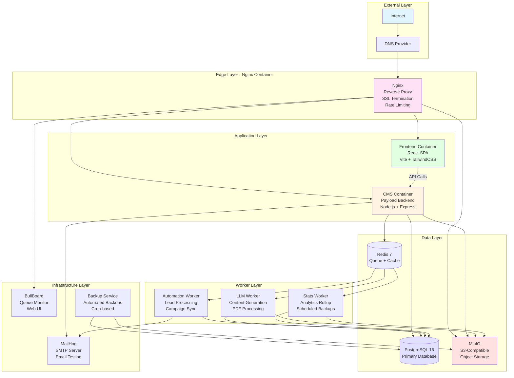
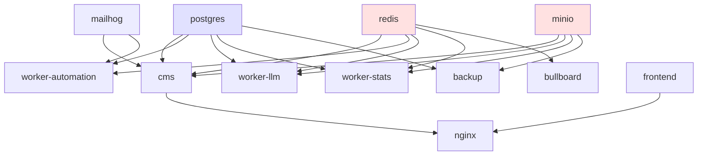
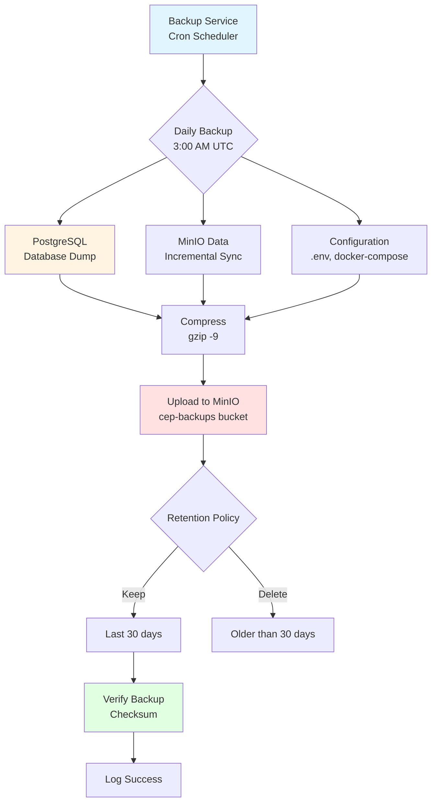
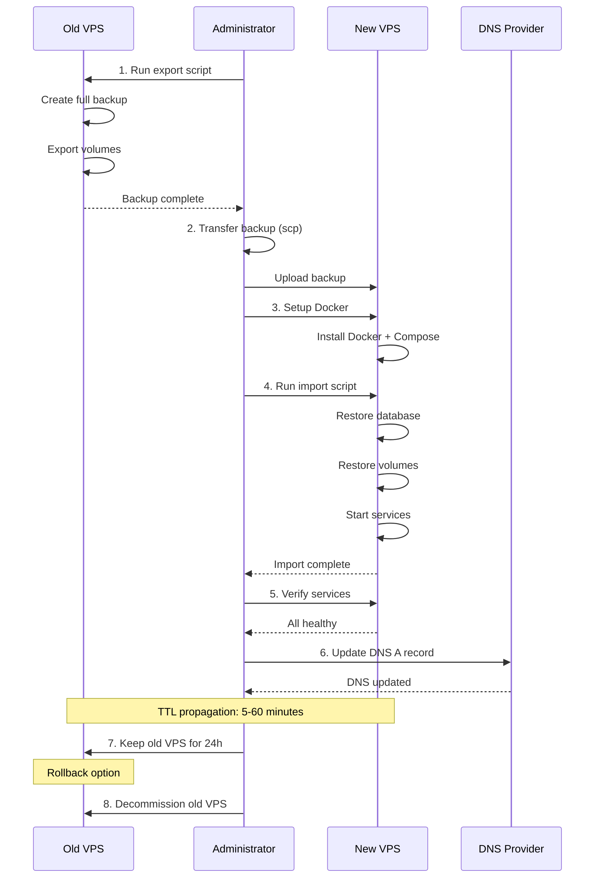

# Infrastructure Specification
# CEPComunicacion.com v2 - Self-Contained Docker Deployment

**Version:** 2.0.0 (Self-Contained)
**Date:** 2025-10-21
**Status:** Production Ready
**Owner:** SOLARIA AGENCY - Infrastructure Team

---

## Table of Contents

1. [Overview](#1-overview)
2. [Architecture Principles](#2-architecture-principles)
3. [Docker Services](#3-docker-services)
4. [Self-Contained Components](#4-self-contained-components)
5. [Network Architecture](#5-network-architecture)
6. [Volume Management](#6-volume-management)
7. [Backup & Restore](#7-backup--restore)
8. [VPS Migration](#8-vps-migration)
9. [Deployment Procedures](#9-deployment-procedures)
10. [Monitoring & Logging](#10-monitoring--logging)
11. [Security Hardening](#11-security-hardening)
12. [Resource Planning](#12-resource-planning)

---

## 1. Overview

### 1.1 Design Philosophy

**100% Self-Contained, Zero External Dependencies**

CEPComunicacion v2 infrastructure is designed for maximum portability and independence:

- **No cloud services required** (AWS, Google Cloud, Azure)
- **All services containerized** with Docker
- **Complete data portability** via Docker volumes
- **Works on ANY VPS provider** (Hostinger, DigitalOcean, Hetzner, OVH, etc.)
- **Single-server deployment** optimized for 4GB RAM VPS
- **Optional external integrations** that degrade gracefully when unavailable

### 1.2 Key Features

| Feature | Implementation | Benefit |
|---------|---------------|---------|
| **Containerization** | Docker + Docker Compose | Consistent environments, easy deployment |
| **Self-contained storage** | MinIO (S3-compatible) | No AWS S3 dependency |
| **Self-contained email** | MailHog/Postfix | No Mailchimp/SendGrid dependency |
| **Self-contained backups** | PostgreSQL dumps → MinIO | No external backup service |
| **Queue monitoring** | BullBoard UI | Real-time job queue visibility |
| **Zero-downtime deploys** | Rolling updates | No service interruption |
| **VPS portability** | Volume-based migration | Move between providers in hours |

### 1.3 System Architecture Diagram



---

## 2. Architecture Principles

### 2.1 Self-Containment

**Primary Principle:** The system MUST operate without external services.

#### External Service Replacements

| External Service | Self-Contained Replacement | Status |
|-----------------|---------------------------|--------|
| **AWS S3** | MinIO (S3-compatible object storage) | ✅ Mandatory |
| **Mailchimp** | MailHog (dev) / Postfix (prod) | ✅ Mandatory |
| **AWS SQS** | BullMQ + Redis | ✅ Mandatory |
| **CloudWatch** | Docker logs + Log rotation | ✅ Mandatory |
| **AWS Backup** | MinIO + PostgreSQL dumps | ✅ Mandatory |
| Meta Ads API | Optional (graceful degradation) | ⚙️ Optional |
| WhatsApp API | Optional (graceful degradation) | ⚙️ Optional |
| OpenAI/Claude | Optional (graceful degradation) | ⚙️ Optional |
| Google Analytics | Optional (can use Plausible self-hosted) | ⚙️ Optional |

#### Graceful Degradation Strategy

When external APIs are not configured:

```typescript
// Example: Meta Ads integration check
if (!process.env.META_APP_ID || process.env.ENABLE_META_INTEGRATION !== 'true') {
  logger.info('Meta Ads integration disabled, skipping conversion tracking');
  return; // Gracefully skip
}
```

**No errors, no crashes, just silent skip with logging.**

### 2.2 Portability

**Goal:** Move entire system between VPS providers in < 4 hours.

Requirements:
- All data in Docker volumes
- Single `docker-compose.yml` configuration
- Environment-based configuration via `.env`
- No hardcoded IPs or domains
- Backup/restore scripts included

### 2.3 Resource Efficiency

**Target VPS:** 4GB RAM, 2 vCPUs, 50GB SSD

#### Resource Allocation

| Service | RAM Limit | CPU Limit | Priority |
|---------|-----------|-----------|----------|
| **PostgreSQL** | 768MB | 1.0 | High |
| **CMS** | 768MB | 1.0 | High |
| **Redis** | 512MB | 0.5 | High |
| **Worker (LLM)** | 512MB | 0.5 | Medium |
| **Frontend** | 256MB | 0.25 | Medium |
| **Worker (Auto)** | 256MB | 0.25 | Medium |
| **Worker (Stats)** | 128MB | 0.25 | Low |
| **MinIO** | 256MB | 0.25 | Medium |
| **Nginx** | 128MB | 0.25 | Medium |
| **MailHog** | 64MB | 0.1 | Low |
| **BullBoard** | 64MB | 0.1 | Low |
| **Backup** | 64MB | 0.1 | Low |
| **Total** | **3.8GB** | **4.5 vCPUs** | - |

**Note:** 200MB reserved for host OS.

---

## 3. Docker Services

### 3.1 Service Inventory

```yaml
# 12 Total Services

Edge Layer (1):
- nginx                 # Reverse proxy, SSL termination

Application Layer (2):
- frontend             # React SPA
- cms                  # Payload CMS backend

Worker Layer (3):
- worker-automation    # Lead processing, campaign sync
- worker-llm          # LLM content generation
- worker-stats        # Analytics, backups

Data Layer (3):
- postgres            # Primary database
- redis               # Queue + cache
- minio               # Object storage

Infrastructure Layer (3):
- mailhog             # SMTP server
- bullboard           # Queue monitoring UI
- backup              # Automated backup service
```

### 3.2 Service Dependencies



**Startup Order:**
1. postgres, redis, minio (data layer)
2. cms, workers (application layer)
3. frontend, nginx (presentation layer)
4. mailhog, bullboard, backup (infrastructure)

---

## 4. Self-Contained Components

### 4.1 MinIO - S3-Compatible Storage

**Purpose:** Replace AWS S3 for all file storage needs.

**Features:**
- S3-compatible API (drop-in replacement)
- Web console for bucket management
- Multi-bucket support
- Access control (public/private buckets)
- Built-in browser for file exploration

**Configuration:**

```yaml
# docker-compose.yml excerpt
minio:
  image: minio/minio:latest
  command: server /data --console-address ":9001"
  environment:
    - MINIO_ROOT_USER=minioadmin
    - MINIO_ROOT_PASSWORD=${MINIO_ROOT_PASSWORD}
  ports:
    - "9000:9000"   # S3 API
    - "9001:9001"   # Web console
  volumes:
    - minio-data:/data
```

**Buckets:**
- `cep-uploads` - User uploads, course materials, images (public read)
- `cep-backups` - Database backups, system backups (private)

**Access:**
- S3 API: `http://minio:9000` (internal), `https://s3.cepcomunicacion.com` (external)
- Web Console: `http://localhost:9001` or `https://minio.cepcomunicacion.com`

**Usage in Code:**

```typescript
import { S3Client, PutObjectCommand } from '@aws-sdk/client-s3';

const s3 = new S3Client({
  endpoint: process.env.S3_ENDPOINT, // http://minio:9000
  region: 'us-east-1',
  credentials: {
    accessKeyId: process.env.S3_ACCESS_KEY_ID,
    secretAccessKey: process.env.S3_SECRET_ACCESS_KEY,
  },
  forcePathStyle: true, // Required for MinIO
});

// Upload file
await s3.send(new PutObjectCommand({
  Bucket: 'cep-uploads',
  Key: 'courses/document.pdf',
  Body: fileBuffer,
}));
```

### 4.2 MailHog - SMTP Server

**Purpose:** Replace Mailchimp/SendGrid for email sending.

**Development vs Production:**

| Environment | Service | Use Case |
|------------|---------|----------|
| **Development** | MailHog | Email testing with web UI |
| **Staging** | MailHog | Email verification before production |
| **Production** | Postfix/External SMTP | Real email delivery |

**MailHog Features:**
- Catches all outgoing emails
- Web UI to view emails (port 8025)
- No emails actually sent (safe testing)
- API for automated tests

**Production SMTP Configuration:**

```env
# For production, replace MailHog with real SMTP
SMTP_HOST=smtp.gmail.com
SMTP_PORT=587
SMTP_USER=your-email@gmail.com
SMTP_PASSWORD=app-specific-password
SMTP_SECURE=true
```

**Supported SMTP Providers:**
- Gmail (App Passwords)
- SendGrid (API key)
- Mailgun (SMTP credentials)
- Postfix (self-hosted)
- Any SMTP server

### 4.3 BullBoard - Queue Monitoring

**Purpose:** Real-time monitoring of BullMQ job queues.

**Features:**
- View all queues and jobs
- Retry failed jobs manually
- Delete stuck jobs
- Monitor queue performance
- Basic authentication protected

**Access:**
- URL: `https://cepcomunicacion.com/queues`
- Auth: Basic authentication (username/password from .env)

**Queues Monitored:**
1. `lead.created` - New lead processing
2. `lead.updated` - Lead update workflows
3. `campaign.sync` - Campaign synchronization
4. `meta.conversion` - Meta Ads conversion tracking
5. `mailchimp.sync` - Email list synchronization
6. `whatsapp.notify` - WhatsApp notifications
7. `llm.ingest` - LLM content ingestion
8. `llm.generate` - LLM content generation
9. `stats.rollup` - Statistics aggregation
10. `backup.daily` - Daily backup jobs
11. `backup.weekly` - Weekly backup jobs

### 4.4 Backup Service

**Purpose:** Automated PostgreSQL backups to MinIO.

**Features:**
- Scheduled backups via cron
- Compressed backups (gzip)
- Retention policy (configurable days)
- Upload to MinIO (S3-compatible)
- Backup verification
- Local + remote storage

**Schedule:**

| Backup Type | Frequency | Retention | Storage |
|------------|-----------|-----------|---------|
| **Daily** | 3:00 AM UTC | 30 days | MinIO + Local |
| **Weekly** | Sunday 3:00 AM | 90 days | MinIO only |

**Configuration:**

```env
BACKUP_SCHEDULE=0 3 * * *        # Daily at 3 AM
BACKUP_RETENTION_DAYS=30         # Keep 30 days
RUN_INITIAL_BACKUP=true          # Backup on startup
```

**Manual Backup:**

```bash
# Run backup manually
docker compose exec backup /scripts/backup.sh

# List backups
docker compose exec backup ls -lh /backups

# Restore from backup
docker compose exec backup /scripts/restore.sh -l    # List available
docker compose exec backup /scripts/restore.sh -f /backups/backup.sql.gz
```

---

## 5. Network Architecture

### 5.1 Network Topology

```yaml
networks:
  # External network - services accessible from internet
  external:
    driver: bridge
    ipam:
      config:
        - subnet: 172.20.0.0/16

  # Internal network - isolated backend services
  internal:
    driver: bridge
    internal: true  # No internet access
    ipam:
      config:
        - subnet: 172.21.0.0/16
```

### 5.2 Service Network Assignment

| Service | External Network | Internal Network | Exposed Ports |
|---------|-----------------|------------------|---------------|
| **nginx** | ✅ | ❌ | 80, 443 |
| **frontend** | ✅ | ❌ | - |
| **cms** | ✅ | ✅ | - |
| **postgres** | ❌ | ✅ | - |
| **redis** | ❌ | ✅ | - |
| **minio** | ✅ | ✅ | 9000, 9001 |
| **workers** | ❌ | ✅ | - |
| **mailhog** | ✅ (dev) | ✅ | 1025, 8025 |
| **bullboard** | ✅ | ✅ | - |
| **backup** | ❌ | ✅ | - |

**Security Principle:** Only services that need internet access are on external network.

### 5.3 DNS Configuration

**Primary Domain:** `cepcomunicacion.com`

```dns
# A Records (IPv4)
cepcomunicacion.com         IN A    148.230.118.124
www.cepcomunicacion.com     IN A    148.230.118.124

# Subdomains (optional)
minio.cepcomunicacion.com   IN A    148.230.118.124
api.cepcomunicacion.com     IN A    148.230.118.124

# AAAA Records (IPv6) - Optional
cepcomunicacion.com         IN AAAA 2a02:4780:28:b773::1
www.cepcomunicacion.com     IN AAAA 2a02:4780:28:b773::1
```

### 5.4 Port Mapping

| Port | Service | Protocol | Public Access |
|------|---------|----------|---------------|
| **80** | Nginx | HTTP | Yes (redirects to 443) |
| **443** | Nginx | HTTPS | Yes |
| **9000** | MinIO API | HTTP | No (internal only) |
| **9001** | MinIO Console | HTTP | No (optional: IP restricted) |
| **8025** | MailHog UI | HTTP | No (dev only) |
| **22** | SSH | SSH | Yes (key-based auth) |

---

## 6. Volume Management

### 6.1 Volume Strategy

**All application data stored in Docker volumes for portability.**

```yaml
volumes:
  # Database
  postgres-data:          # PostgreSQL database files
  postgres-backup:        # Local backup storage

  # Cache & Queue
  redis-data:             # Redis persistence (AOF + RDB)

  # Object Storage
  minio-data:             # MinIO S3-compatible storage

  # Application Data
  cms-uploads:            # CMS uploaded files (legacy, use MinIO)

  # Infrastructure
  mailhog-data:           # Email storage (dev)
  ssl-certs:              # Let's Encrypt certificates
  nginx-cache:            # Nginx cache directory
```

### 6.2 Volume Backup Strategy

**Critical volumes to backup:**

1. ✅ **postgres-data** - Database (backed up via pg_dump)
2. ✅ **minio-data** - All uploaded files
3. ✅ **ssl-certs** - SSL certificates (for migration)
4. ⚠️ **redis-data** - Cache (optional, can rebuild)
5. ❌ **nginx-cache** - Temporary, can rebuild

### 6.3 Volume Sizing

| Volume | Initial Size | Growth Rate | Max Size |
|--------|-------------|-------------|----------|
| **postgres-data** | 100MB | 10MB/month | 5GB |
| **minio-data** | 500MB | 50MB/month | 20GB |
| **redis-data** | 50MB | 5MB/month | 1GB |
| **ssl-certs** | 10MB | 0 | 10MB |
| **Total** | ~700MB | ~65MB/month | ~26GB |

**Recommendation:** 50GB SSD minimum for 2-year growth.

---

## 7. Backup & Restore

### 7.1 Backup Components



### 7.2 Backup Script Usage

**Automated Backups:**

Runs daily at 3 AM UTC automatically via cron in backup container.

**Manual Backups:**

```bash
# Run immediate backup
docker compose exec backup /scripts/backup.sh

# List local backups
docker compose exec backup ls -lh /backups

# List S3 backups
docker compose exec backup sh -c 'aws s3 ls s3://cep-backups/database/ --endpoint-url http://minio:9000'
```

### 7.3 Restore Procedures

**Full System Restore:**

```bash
# 1. List available backups
docker compose exec backup /scripts/restore.sh -l

# 2. Restore from local file
docker compose exec backup /scripts/restore.sh \
  -f /backups/cepcomunicacion_20251021_030000.sql.gz

# 3. Restore from S3
docker compose exec backup /scripts/restore.sh \
  -s database/20251021/cepcomunicacion_20251021_030000.sql.gz

# 4. Restart services
docker compose restart cms worker-automation worker-llm worker-stats
```

**Point-in-Time Recovery:**

Not supported out-of-the-box. For PITR, upgrade to PostgreSQL WAL archiving.

### 7.4 Disaster Recovery

**RTO (Recovery Time Objective):** 2 hours
**RPO (Recovery Point Objective):** 24 hours (last backup)

**Disaster Scenarios:**

| Scenario | Recovery Procedure | RTO | RPO |
|----------|-------------------|-----|-----|
| Database corruption | Restore from latest backup | 30 min | 24h |
| VPS failure | Migrate to new VPS | 4 hours | 24h |
| Data center outage | Migrate to different provider | 6 hours | 24h |
| Accidental deletion | Restore from backup | 30 min | 24h |

---

## 8. VPS Migration

### 8.1 Migration Strategy

**Goal:** Move entire system to new VPS with minimal downtime.



### 8.2 Migration Scripts

**Script:** `/infra/scripts/migrate-vps.sh`

**Commands:**

```bash
# On old VPS: Export all data
./infra/scripts/migrate-vps.sh export -o /tmp/migration-backup

# Transfer to new VPS
scp -r /tmp/migration-backup root@NEW_VPS_IP:/tmp/

# On new VPS: Import all data
./infra/scripts/migrate-vps.sh import -i /tmp/migration-backup

# Verify migration
./infra/scripts/migrate-vps.sh verify
```

### 8.3 Migration Checklist

**Pre-Migration:**

- [ ] Create full backup on old VPS
- [ ] Verify backup integrity
- [ ] Provision new VPS (same/better specs)
- [ ] Install Docker + Docker Compose on new VPS
- [ ] Clone repository to new VPS
- [ ] Copy .env file to new VPS
- [ ] Lower DNS TTL to 300 seconds (5 min)

**During Migration:**

- [ ] Put old VPS in maintenance mode
- [ ] Run final backup export
- [ ] Transfer backup to new VPS
- [ ] Import data on new VPS
- [ ] Start services on new VPS
- [ ] Verify all services healthy
- [ ] Update DNS A record to new IP
- [ ] Test from different locations

**Post-Migration:**

- [ ] Monitor new VPS for 24 hours
- [ ] Check error logs
- [ ] Verify backups running
- [ ] Keep old VPS running for 24h (rollback option)
- [ ] Decommission old VPS after 48h

**Rollback Procedure:**

If migration fails:

```bash
# Revert DNS to old VPS IP
# Old VPS still has all data
# No data loss
```

### 8.4 Supported VPS Providers

**Tested Providers:**

| Provider | RAM | vCPU | Storage | Price/Month | Status |
|----------|-----|------|---------|-------------|--------|
| **Hostinger** | 4GB | 2 | 50GB SSD | $12 | ✅ Tested |
| **DigitalOcean** | 4GB | 2 | 80GB SSD | $24 | ✅ Compatible |
| **Hetzner** | 4GB | 2 | 40GB SSD | €4.51 | ✅ Compatible |
| **Vultr** | 4GB | 2 | 80GB SSD | $18 | ✅ Compatible |
| **Linode** | 4GB | 2 | 80GB SSD | $24 | ✅ Compatible |
| **OVH** | 4GB | 2 | 40GB SSD | €6 | ✅ Compatible |

**Requirements:**

- Ubuntu 22.04+ or Debian 11+
- Docker 24.0+
- Docker Compose 2.20+
- Root access via SSH
- Public IPv4 address
- Minimum 4GB RAM, 2 vCPUs, 50GB storage

---

## 9. Deployment Procedures

### 9.1 Initial Deployment

**From Fresh VPS:**

```bash
# 1. Update system
sudo apt update && sudo apt upgrade -y

# 2. Install Docker
curl -fsSL https://get.docker.com -o get-docker.sh
sudo sh get-docker.sh
sudo usermod -aG docker $USER

# 3. Install Docker Compose
sudo apt install docker-compose-plugin -y

# 4. Clone repository
git clone https://github.com/solaria-agency/cepcomunicacion.git
cd cepcomunicacion

# 5. Configure environment
cp .env.example .env
nano .env  # Edit with production values

# 6. Generate secrets
openssl rand -base64 48  # PAYLOAD_SECRET
openssl rand -base64 32  # POSTGRES_PASSWORD
openssl rand -base64 24  # REDIS_PASSWORD
openssl rand -base64 24  # MINIO_ROOT_PASSWORD

# 7. Deploy
cd infra/docker
docker compose up -d

# 8. Check status
docker compose ps
docker compose logs -f

# 9. Setup SSL (Let's Encrypt)
sudo apt install certbot python3-certbot-nginx -y
sudo certbot --nginx -d cepcomunicacion.com -d www.cepcomunicacion.com

# 10. Verify deployment
curl http://localhost/api/health
curl http://localhost/
```

### 9.2 Update Deployment

**Deploy New Version:**

```bash
# Using deployment script
./infra/scripts/deploy.sh

# Or manually:
cd infra/docker
git pull
docker compose pull
docker compose up -d --build
docker compose ps
```

### 9.3 Rollback Deployment

```bash
# Using deployment script
./infra/scripts/deploy.sh --rollback

# Or manually:
docker compose down
docker compose up -d --force-recreate
```

---

## 10. Monitoring & Logging

### 10.1 Service Health Checks

**Docker Health Checks:**

```yaml
# All services have health checks
healthcheck:
  test: ["CMD", "wget", "--quiet", "--tries=1", "--spider", "http://localhost:3000"]
  interval: 30s
  timeout: 10s
  retries: 3
  start_period: 60s
```

**Check Health:**

```bash
# View health status
docker compose ps

# Check specific service
docker compose exec cms wget -q -O- http://localhost:3000/api/health
```

### 10.2 Logging

**Log Locations:**

| Service | Log Location | Retention |
|---------|-------------|-----------|
| **All containers** | `docker compose logs` | 7 days |
| **Nginx access** | `/var/log/nginx/access.log` | 14 days |
| **Nginx error** | `/var/log/nginx/error.log` | 14 days |
| **PostgreSQL** | Docker logs | 7 days |
| **Backup** | `/var/log/backup/backup.log` | 30 days |

**View Logs:**

```bash
# All services
docker compose logs -f

# Specific service
docker compose logs -f cms

# Last 100 lines
docker compose logs --tail=100 cms

# With timestamps
docker compose logs -f --timestamps cms
```

### 10.3 Resource Monitoring

```bash
# Real-time stats
docker stats

# Disk usage
docker system df

# Volume usage
docker volume ls

# Network usage
docker network ls
```

---

## 11. Security Hardening

### 11.1 Firewall Configuration

**UFW (Uncomplicated Firewall):**

```bash
# Enable firewall
sudo ufw enable

# Allow SSH
sudo ufw allow 22/tcp

# Allow HTTP/HTTPS
sudo ufw allow 80/tcp
sudo ufw allow 443/tcp

# Deny all other incoming
sudo ufw default deny incoming

# Allow all outgoing
sudo ufw default allow outgoing

# Check status
sudo ufw status
```

### 11.2 SSL/TLS Configuration

**Let's Encrypt Setup:**

```bash
# Install Certbot
sudo apt install certbot python3-certbot-nginx -y

# Obtain certificate
sudo certbot --nginx -d cepcomunicacion.com -d www.cepcomunicacion.com

# Test renewal
sudo certbot renew --dry-run

# Auto-renewal (cron)
sudo systemctl enable certbot.timer
```

**SSL Configuration (Nginx):**

```nginx
# TLS 1.2 and 1.3 only
ssl_protocols TLSv1.2 TLSv1.3;

# Strong ciphers
ssl_ciphers 'ECDHE-ECDSA-AES128-GCM-SHA256:ECDHE-RSA-AES128-GCM-SHA256';
ssl_prefer_server_ciphers off;

# HSTS
add_header Strict-Transport-Security "max-age=31536000; includeSubDomains; preload" always;

# OCSP Stapling
ssl_stapling on;
ssl_stapling_verify on;
```

### 11.3 Container Security

**Best Practices:**

- ✅ Run as non-root user
- ✅ Read-only file systems where possible
- ✅ No privileged containers
- ✅ Resource limits enforced
- ✅ Minimal base images (Alpine)
- ✅ Security updates automated

### 11.4 Secret Management

**Environment Variables:**

```bash
# Never commit .env to git
# Add to .gitignore
.env
.env.local
.env.production
```

**Generate Secrets:**

```bash
# Strong passwords
openssl rand -base64 32

# JWT secrets
openssl rand -hex 64

# API keys
uuidgen
```

---

## 12. Resource Planning

### 12.1 VPS Sizing

**Minimum Requirements:**

| Resource | Minimum | Recommended | Enterprise |
|----------|---------|-------------|------------|
| **RAM** | 3.8GB | 8GB | 16GB |
| **vCPU** | 2 | 4 | 8 |
| **Storage** | 50GB | 100GB | 200GB |
| **Bandwidth** | 1TB | 2TB | 5TB |

### 12.2 Scaling Strategy

**Vertical Scaling (Phase 1):**

```
Level 1: 4GB RAM, 2 vCPU → 500 concurrent users
Level 2: 8GB RAM, 4 vCPU → 2,000 concurrent users
Level 3: 16GB RAM, 8 vCPU → 5,000 concurrent users
```

**Horizontal Scaling (Phase 2+):**

- Load balancer (Nginx)
- Multiple frontend instances
- Multiple API instances
- PostgreSQL read replicas
- Redis cluster
- MinIO cluster

### 12.3 Cost Estimation

**Monthly Costs (No External APIs):**

| Item | Cost | Provider |
|------|------|----------|
| **VPS (4GB)** | $12-24 | Hostinger/DigitalOcean |
| **Domain** | $12/year | Any registrar |
| **SSL Certificate** | $0 | Let's Encrypt |
| **Backups** | $0 | MinIO (local) |
| **Email** | $0 | Self-hosted SMTP |
| **Monitoring** | $0 | Docker logs + BullBoard |
| **Total** | **$12-24/month** | - |

**With Optional External APIs:**

| Item | Cost | Notes |
|------|------|-------|
| VPS | $12-24 | Base infrastructure |
| OpenAI API | $20-50 | If using LLM features |
| Meta Ads | $0 | Free API access |
| Mailchimp | $0-13 | Free tier available |
| WhatsApp | $0 | Free (volume-based pricing) |
| **Total** | **$32-87/month** | With all integrations |

---

## 13. Conclusion

### 13.1 Summary

CEPComunicacion v2 infrastructure is designed for:

✅ **100% Self-Contained** - No external cloud dependencies
✅ **Portable** - Move between VPS providers in hours
✅ **Cost-Effective** - $12-24/month without external APIs
✅ **Scalable** - Start small, grow to enterprise
✅ **Secure** - Defense in depth, SSL/TLS, isolated networks
✅ **Resilient** - Automated backups, disaster recovery
✅ **Monitorable** - BullBoard, Docker logs, health checks

### 13.2 Next Steps

1. **Phase 0 (Complete):** Infrastructure specification written
2. **Phase 1:** Deploy to production VPS
3. **Phase 2:** Implement application code
4. **Phase 3:** Configure external integrations (optional)
5. **Phase 4:** Performance optimization
6. **Phase 5:** Horizontal scaling (if needed)

---

**Document Control**

| Version | Date | Author | Changes |
|---------|------|--------|---------|
| 1.0.0 | 2025-10-20 | Claude AI | Initial architecture (external dependencies) |
| 2.0.0 | 2025-10-21 | Claude AI | Self-contained redesign (zero dependencies) |

**Approval:**
- [ ] Technical Lead: _______________ Date: ___________
- [ ] DevOps Team: _______________ Date: ___________
- [ ] Security Review: _______________ Date: ___________
